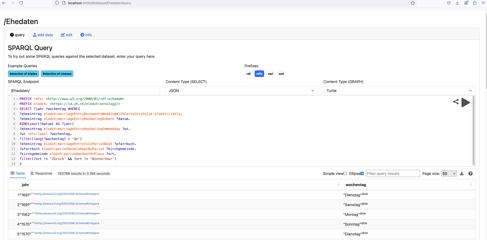

# Wissensnetz der Zürcher Ehedaten 16. - 18. Jh. (Basis-Version) 

Die Daten liegen im Moment auf keinem öffentlichen Tripplestore. Sie können aber problemlos in einen lokalen Tripplestore geladen und abgefragt werden. Am besten eignet sich dafür Appache Jena Fuseki:

Lade die Fuseki-Distribution von der offiziellen [Apache Jena Webseite](https://jena.apache.org/download/index.cgi) herunter. Entzippe die zip-Datei (zum Zeitpunkt der Erstellung dieser Anleitung: *apache-jena-fuseki-5.1.0.zip*) in einem Verzeichnis deiner Wahl.

Öffne ein Terminal oder eine Eingabeaufforderung und navigiere zu dem Verzeichnis, in dem du Fuseki entpackt hast. Starte den Server mit:

```bash
./fuseki-server
```
Ruf nun folgenden Link im Browser auf:

```
http://localhost:3030/
```

Über *manage* kannst du nun ein neues Datenset erstellen (am besten mit Option *persistent*), alle [Daten](data) hochladen und mit den [Beispielabfragen](queries) starten.

Für weitere mögliche Abfragen konsultiere am besten das [Datenmodell bzw. die Ontologie](ontology).

<div align="center"></div>
