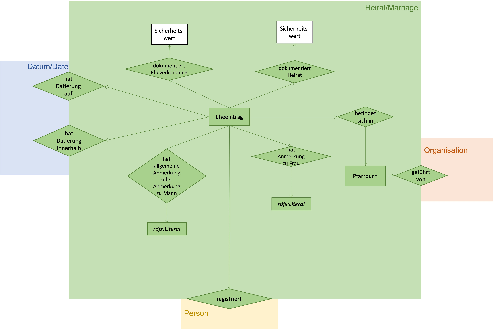
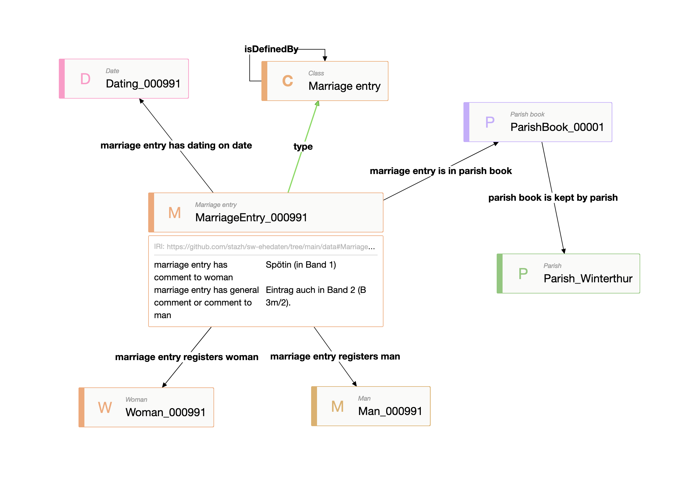

# Ontology marriage
## Modell

## Beispiel

## Definition der Klassen und Beziehungen
| Predicate | Object |
|:-------- |:-------- |
| [rdf:type](http://www.w3.org/1999/02/22-rdf-syntax-ns#type) | [owl:Ontology](http://www.w3.org/2002/07/owl#Ontology); |
| [dct:license](http://purl.org/dc/terms/license) | <http://creativecommons.org/licenses/by/3.0/>; |
| [dct:title](http://purl.org/dc/terms/title) | "An ontology about marriage"@en; |
| [dct:description](http://purl.org/dc/terms/description) | """Formal description of a marriage, general subclasses, related classes and properties."""@en; |
| [dct:creator](http://purl.org/dc/terms/creator) | "Rebekka Plüss, research assistant and software developer, States Archive canton of Zürich"@en; |
| [dct:publisher](http://purl.org/dc/terms/publisher) | "States Archive canton of Zürich"@en; |
| [owl:versionInfo](http://www.w3.org/2002/07/owl#versionInfo) | "2021-11-26"^^xsd:date. |
# CLASSES
## Wedding
| Predicate | Object |
|:-------- |:-------- |
| [rdfs:isDefinedBy](http://www.w3.org/2000/01/rdf-schema#isDefinedBy) | <https://github.com/stazh/sw-ehedaten/tree/main/ontology/marriage#Marriage>; |
| [rdf:type](http://www.w3.org/1999/02/22-rdf-syntax-ns#type) | [rdfs:Class](http://www.w3.org/2000/01/rdf-schema#Class); |
| [rdfs:label](http://www.w3.org/2000/01/rdf-schema#label) | "Wedding"@en, "Heirat"@de; |
| [rdfs:comment](http://www.w3.org/2000/01/rdf-schema#comment) | """Wedding as the event of the union of two people."""@en; |
| [rdfs:subClassOf](http://www.w3.org/2000/01/rdf-schema#subClassOf) | [nie-ine-event:Event](http://e-editiones.ch/ontology/event#Event). |
## MarriageProclamation
| Predicate | Object |
|:-------- |:-------- |
| [rdfs:isDefinedBy](http://www.w3.org/2000/01/rdf-schema#isDefinedBy) | <https://github.com/stazh/sw-ehedaten/tree/main/ontology/marriage#MarriageProclamation>; |
| [rdf:type](http://www.w3.org/1999/02/22-rdf-syntax-ns#type) | [rdfs:Class](http://www.w3.org/2000/01/rdf-schema#Class); |
| [rdfs:label](http://www.w3.org/2000/01/rdf-schema#label) | "Marriage proclamation"@en, "Heiratsverkündung"@de; |
| [rdfs:comment](http://www.w3.org/2000/01/rdf-schema#comment) | """Marriage proclamation as the event of the proclamation of the union of two people in future."""@en; |
| [rdfs:subClassOf](http://www.w3.org/2000/01/rdf-schema#subClassOf) | [nie-ine-event:Event](http://e-editiones.ch/ontology/event#Event). |
## ParishBook
| Predicate | Object |
|:-------- |:-------- |
| [rdfs:isDefinedBy](http://www.w3.org/2000/01/rdf-schema#isDefinedBy) | <https://github.com/stazh/sw-ehedaten/tree/main/ontology/marriage#ParishBook>; |
| [rdf:type](http://www.w3.org/1999/02/22-rdf-syntax-ns#type) | [rdfs:Class](http://www.w3.org/2000/01/rdf-schema#Class); |
| [rdfs:label](http://www.w3.org/2000/01/rdf-schema#label) | "Parish book"@en, "Pfarrbuch"@de; |
| [rdfs:comment](http://www.w3.org/2000/01/rdf-schema#comment) | """The book in which a wedding or marriage proclamation is registered resp. the marriage entry is written."""@en. |
## MarriageEntry
| Predicate | Object |
|:-------- |:-------- |
| [rdfs:isDefinedBy](http://www.w3.org/2000/01/rdf-schema#isDefinedBy) | <https://github.com/stazh/sw-ehedaten/tree/main/ontology/marriage#MarriageEntry>; |
| [rdf:type](http://www.w3.org/1999/02/22-rdf-syntax-ns#type) | [rdfs:Class](http://www.w3.org/2000/01/rdf-schema#Class); |
| [rdfs:label](http://www.w3.org/2000/01/rdf-schema#label) | "Marriage entry"@en, "Eheeintrag"@de; |
| [rdfs:comment](http://www.w3.org/2000/01/rdf-schema#comment) | """Marriage entry as a note by the parish priest in a parish book stating that two persons were married on a certain day or that the marriage of two persons is proclaimed on a certain day."""@en. |
# PROPERTIES
## marriageEntryIsInParishBook
| Predicate | Object |
|:-------- |:-------- |
| [rdfs:isDefinedBy](http://www.w3.org/2000/01/rdf-schema#isDefinedBy) | <https://github.com/stazh/sw-ehedaten/tree/main/ontology/marriage#marriageEntryIsInParishBook>; |
| [rdf:type](http://www.w3.org/1999/02/22-rdf-syntax-ns#type) | [owl:ObjectProperty](http://www.w3.org/2002/07/owl#ObjectProperty); |
| [rdfs:label](http://www.w3.org/2000/01/rdf-schema#label) | "marriage entry is in parish book"@en, "Eheeintrag befindet sich in Pfarrbuch"@de; |
| [rdfs:comment](http://www.w3.org/2000/01/rdf-schema#comment) | """Relating a marriage entry to its parish book in which it is written."""@en; |
| [rdfs:domain](http://www.w3.org/2000/01/rdf-schema#domain) | [marriage:MarriageEntry](https://github.com/stazh/sw-ehedaten/tree/main/ontology/marriage#MarriageEntry); |
| [rdfs:range](http://www.w3.org/2000/01/rdf-schema#range) | [marriage:ParishBook](https://github.com/stazh/sw-ehedaten/tree/main/ontology/marriage#ParishBook). |
## marriageEntryHasCommentToWoman
| Predicate | Object |
|:-------- |:-------- |
| [rdfs:isDefinedBy](http://www.w3.org/2000/01/rdf-schema#isDefinedBy) | <https://github.com/stazh/sw-ehedaten/tree/main/ontology/marriage#marriageEntryHasCommentToWoman>; |
| [rdf:type](http://www.w3.org/1999/02/22-rdf-syntax-ns#type) | [owl:DatatypeProperty](http://www.w3.org/2002/07/owl#DatatypeProperty); |
| [rdfs:label](http://www.w3.org/2000/01/rdf-schema#label) | "marriage entry has comment to woman"@en, "Eheeintrag hat Anmerkung zu Frau"@de; |
| [rdfs:comment](http://www.w3.org/2000/01/rdf-schema#comment) | """Relating a marriage entry to the comment written as a note next to the woman registered in the entry."""@en; |
| [rdfs:domain](http://www.w3.org/2000/01/rdf-schema#domain) | [marriage:MarriageEntry](https://github.com/stazh/sw-ehedaten/tree/main/ontology/marriage#MarriageEntry); |
| [rdfs:range](http://www.w3.org/2000/01/rdf-schema#range) | [rdfs:Literal](http://www.w3.org/2000/01/rdf-schema#Literal). |
## marriageEntryHasGeneralCommentOrCommentToMan
| Predicate | Object |
|:-------- |:-------- |
| [rdfs:isDefinedBy](http://www.w3.org/2000/01/rdf-schema#isDefinedBy) | <https://github.com/stazh/sw-ehedaten/tree/main/ontology/marriage#marriageEntryHasGeneralCommentOrCommentToMan>; |
| [rdf:type](http://www.w3.org/1999/02/22-rdf-syntax-ns#type) | [owl:DatatypeProperty](http://www.w3.org/2002/07/owl#DatatypeProperty); |
| [rdfs:label](http://www.w3.org/2000/01/rdf-schema#label) | "marriage entry has general comment or comment to man"@en, "Eheeintrag hat allgemeine Anmerkung oder Anmerkung zu Mann"@de; |
| [rdfs:comment](http://www.w3.org/2000/01/rdf-schema#comment) | """Relating a marriage entry to the comment written as a note next to the man registered in the entry. It mustn't be a comment to the man, it can also be a general comment to the marriage."""@en; |
| [rdfs:domain](http://www.w3.org/2000/01/rdf-schema#domain) | [marriage:MarriageEntry](https://github.com/stazh/sw-ehedaten/tree/main/ontology/marriage#MarriageEntry); |
| [rdfs:range](http://www.w3.org/2000/01/rdf-schema#range) | [rdfs:Literal](http://www.w3.org/2000/01/rdf-schema#Literal). |
## parishBookIsKeptByParish
| Predicate | Object |
|:-------- |:-------- |
| [rdfs:isDefinedBy](http://www.w3.org/2000/01/rdf-schema#isDefinedBy) | <https://github.com/stazh/sw-ehedaten/tree/main/ontology/marriage#parishBookIsKeptByParish>; |
| [rdf:type](http://www.w3.org/1999/02/22-rdf-syntax-ns#type) | [owl:ObjectProperty](http://www.w3.org/2002/07/owl#ObjectProperty); |
| [rdfs:label](http://www.w3.org/2000/01/rdf-schema#label) | "parish book is kept by parish"@en, "Pfarrbuch wird geführt von Kirchgemeinde"@de; |
| [rdfs:comment](http://www.w3.org/2000/01/rdf-schema#comment) | """Relating a parish book to the parish in which it is kept."""@en; |
| [rdfs:domain](http://www.w3.org/2000/01/rdf-schema#domain) | [marriage:ParishBook](https://github.com/stazh/sw-ehedaten/tree/main/ontology/marriage#ParishBook); |
| [rdfs:range](http://www.w3.org/2000/01/rdf-schema#range) | [organisation:Parish](https://github.com/stazh/sw-ehedaten/tree/main/ontology/organisation#Parish). |
## marriageEntryRegistersWoman
| Predicate | Object |
|:-------- |:-------- |
| [rdfs:isDefinedBy](http://www.w3.org/2000/01/rdf-schema#isDefinedBy) | <https://github.com/stazh/sw-ehedaten/tree/main/ontology/marriage#marriageEntryRegistersWoman>; |
| [rdf:type](http://www.w3.org/1999/02/22-rdf-syntax-ns#type) | [owl:ObjectProperty](http://www.w3.org/2002/07/owl#ObjectProperty); |
| [rdfs:label](http://www.w3.org/2000/01/rdf-schema#label) | "marriage entry registers woman"@en, "Eheeintrag registriert Frau"@de; |
| [rdfs:comment](http://www.w3.org/2000/01/rdf-schema#comment) | """Relating a marriage entry to the woman it registers."""@en; |
| [rdfs:domain](http://www.w3.org/2000/01/rdf-schema#domain) | [marriage:MarriageEntry](https://github.com/stazh/sw-ehedaten/tree/main/ontology/marriage#MarriageEntry); |
| [rdfs:range](http://www.w3.org/2000/01/rdf-schema#range) | [person:Woman](https://github.com/stazh/sw-ehedaten/tree/main/ontology/person#Woman); |
| [rdfs:subPropertyOf](http://www.w3.org/2000/01/rdf-schema#subPropertyOf) | [marriage:marriageEntryRegistersPerson](https://github.com/stazh/sw-ehedaten/tree/main/ontology/marriage#marriageEntryRegistersPerson). |
## marriageEntryRegistersMan
| Predicate | Object |
|:-------- |:-------- |
| [rdfs:isDefinedBy](http://www.w3.org/2000/01/rdf-schema#isDefinedBy) | <https://github.com/stazh/sw-ehedaten/tree/main/ontology/marriage#marriageEntryRegistersMan>; |
| [rdf:type](http://www.w3.org/1999/02/22-rdf-syntax-ns#type) | [owl:ObjectProperty](http://www.w3.org/2002/07/owl#ObjectProperty); |
| [rdfs:label](http://www.w3.org/2000/01/rdf-schema#label) | "marriage entry registers man"@en, "Eheeintrag registriert Mann"@de; |
| [rdfs:comment](http://www.w3.org/2000/01/rdf-schema#comment) | """Relating a marriage entry to the man it registers."""@en; |
| [rdfs:domain](http://www.w3.org/2000/01/rdf-schema#domain) | [marriage:MarriageEntry](https://github.com/stazh/sw-ehedaten/tree/main/ontology/marriage#MarriageEntry); |
| [rdfs:range](http://www.w3.org/2000/01/rdf-schema#range) | [person:Man](https://github.com/stazh/sw-ehedaten/tree/main/ontology/person#Man); |
| [rdfs:subPropertyOf](http://www.w3.org/2000/01/rdf-schema#subPropertyOf) | [marriage:marriageEntryRegistersPerson](https://github.com/stazh/sw-ehedaten/tree/main/ontology/marriage#marriageEntryRegistersPerson). |
## marriageEntryRegistersPerson
| Predicate | Object |
|:-------- |:-------- |
| [rdfs:isDefinedBy](http://www.w3.org/2000/01/rdf-schema#isDefinedBy) | <https://github.com/stazh/sw-ehedaten/tree/main/ontology/marriage#marriageEntryRegistersPerson>; |
| [rdf:type](http://www.w3.org/1999/02/22-rdf-syntax-ns#type) | [owl:ObjectProperty](http://www.w3.org/2002/07/owl#ObjectProperty); |
| [rdfs:label](http://www.w3.org/2000/01/rdf-schema#label) | "marriage entry registers person"@en, "Eheeintrag registriert Person"@de; |
| [rdfs:comment](http://www.w3.org/2000/01/rdf-schema#comment) | """Relating a marriage entry to the person it registers."""@en; |
| [rdfs:domain](http://www.w3.org/2000/01/rdf-schema#domain) | [marriage:MarriageEntry](https://github.com/stazh/sw-ehedaten/tree/main/ontology/marriage#MarriageEntry); |
| [rdfs:range](http://www.w3.org/2000/01/rdf-schema#range) | [person:Person](https://github.com/stazh/sw-ehedaten/tree/main/ontology/person#Person). |
## marriageEntryHasDatingOnDate
| Predicate | Object |
|:-------- |:-------- |
| [rdfs:isDefinedBy](http://www.w3.org/2000/01/rdf-schema#isDefinedBy) | <https://github.com/stazh/sw-ehedaten/tree/main/ontology/marriage#marriageEntryHasDatingOnDate>; |
| [rdf:type](http://www.w3.org/1999/02/22-rdf-syntax-ns#type) | [owl:ObjectProperty](http://www.w3.org/2002/07/owl#ObjectProperty); |
| [rdfs:label](http://www.w3.org/2000/01/rdf-schema#label) | "marriage entry has dating on date"@en, "Eheeintrag hat Datierung auf Datum"@de; |
| [rdfs:comment](http://www.w3.org/2000/01/rdf-schema#comment) | """Relating a marriage entry to its registered date."""@en; |
| [rdfs:domain](http://www.w3.org/2000/01/rdf-schema#domain) | [marriage:MarriageEntry](https://github.com/stazh/sw-ehedaten/tree/main/ontology/marriage#MarriageEntry); |
| [rdfs:range](http://www.w3.org/2000/01/rdf-schema#range) | [date:Date](https://github.com/stazh/sw-ehedaten/tree/main/ontology/date#Date). |
## marriageEntryHasDatingWithinDatePeriod
| Predicate | Object |
|:-------- |:-------- |
| [rdfs:isDefinedBy](http://www.w3.org/2000/01/rdf-schema#isDefinedBy) | <https://github.com/stazh/sw-ehedaten/tree/main/ontology/marriage#marriageEntryHasDatingWithinDatePeriod>; |
| [rdf:type](http://www.w3.org/1999/02/22-rdf-syntax-ns#type) | [owl:ObjectProperty](http://www.w3.org/2002/07/owl#ObjectProperty); |
| [rdfs:label](http://www.w3.org/2000/01/rdf-schema#label) | "marriage entry has dating within date period"@en, "Eheeintrag hat Datierung innerhalb Datumsperiode"@de; |
| [rdfs:comment](http://www.w3.org/2000/01/rdf-schema#comment) | """Relating a marriage entry to the date period within its dating is possible."""@en; |
| [rdfs:domain](http://www.w3.org/2000/01/rdf-schema#domain) | [marriage:MarriageEntry](https://github.com/stazh/sw-ehedaten/tree/main/ontology/marriage#MarriageEntry); |
| [rdfs:range](http://www.w3.org/2000/01/rdf-schema#range) | [date:DatePeriod](https://github.com/stazh/sw-ehedaten/tree/main/ontology/date#DatePeriod). |
## marriageEntryDocumentsMarriageProclamationWithCertaintyValue
| Predicate | Object |
|:-------- |:-------- |
| [rdfs:isDefinedBy](http://www.w3.org/2000/01/rdf-schema#isDefinedBy) | <https://github.com/stazh/sw-ehedaten/tree/main/ontology/marriage#marriageEntryDocumentsMarriageProclamationWithCertaintyValue>; |
| [rdf:type](http://www.w3.org/1999/02/22-rdf-syntax-ns#type) | [owl:ObjectProperty](http://www.w3.org/2002/07/owl#ObjectProperty); |
| [rdfs:label](http://www.w3.org/2000/01/rdf-schema#label) | "marriage entry documents marriage proclamation with certainty value"@en, "Eheeintrag dokumentiert Eheverkündung mit Sicherheitswert"@de; |
| [rdfs:comment](http://www.w3.org/2000/01/rdf-schema#comment) | """Relating a marriage entry to the certainty value with which it is possible, that the marriage entry documents a marriage proclamation."""@en, """Ein Eheeintrag betrifft entweder eine Verkündung (Proclamation) oder eine Trauung (Wedding): a) Fällt die Datierung eines Eheeintrags auf den Sonntag, so betrifft dieser ab 1620 (Verbot von Sonntagsheiraten) sehr wahrscheinlich eine Verkündung. b) Vermerkte der Editor '[Verkünddatum]' in den Zusatzinformationen eines Eheeintrags oder steht 'promulgiert' oder 'proklamiert' so betrifft dieser sehr wahrscheinlich eine Verkündung. c) Steht in den Zusatzinformationen eines Eheeintrags 'getraut zu ', so betrifft dieser sehr wahrscheinlich eine Verkündung. Trifft a, b und c nicht zu, so betrifft der Eheeintrag wahrscheinlich die Trauung (Wedding)."""@de; |
| [rdfs:domain](http://www.w3.org/2000/01/rdf-schema#domain) | [marriage:MarriageEntry](https://github.com/stazh/sw-ehedaten/tree/main/ontology/marriage#MarriageEntry); |
| [rdfs:range](http://www.w3.org/2000/01/rdf-schema#range) | [certainty-value:CertaintyValue](https://github.com/stazh/sw-ehedaten/tree/main/ontology/certainty-value#CertaintyValue). |
## marriageEntryDocumentsWeddingWithCertaintyValue
| Predicate | Object |
|:-------- |:-------- |
| [rdfs:isDefinedBy](http://www.w3.org/2000/01/rdf-schema#isDefinedBy) | <https://github.com/stazh/sw-ehedaten/tree/main/ontology/marriage#marriageEntryDocumentsWeddingWithCertaintyValue>; |
| [rdf:type](http://www.w3.org/1999/02/22-rdf-syntax-ns#type) | [owl:ObjectProperty](http://www.w3.org/2002/07/owl#ObjectProperty); |
| [rdfs:label](http://www.w3.org/2000/01/rdf-schema#label) | "marriage entry documents wedding with certainty value"@en, "Eheeintrag dokumentiert Heirat mit Sicherheitswert"@de; |
| [rdfs:comment](http://www.w3.org/2000/01/rdf-schema#comment) | """Relating a marriage entry to the certainty value with which it is possible, that the marriage entry documents a wedding."""@en, """Ein Eheeintrag betrifft entweder eine Verkündung (Proclamation) oder eine Trauung (Wedding): a) Fällt die Datierung eines Eheeintrags auf den Sonntag, so betrifft dieser ab 1620 (Verbot von Sonntagsheiraten) sehr wahrscheinlich eine Verkündung. b) Vermerkte der Editor '[Verkünddatum]' in den Zusatzinformationen eines Eheeintrags oder steht 'promulgiert' oder 'proklamiert' so betrifft dieser sehr wahrscheinlich eine Verkündung. c) Steht in den Zusatzinformationen eines Eheeintrags 'getraut zu ', so betrifft dieser sehr wahrscheinlich eine Verkündung. Trifft a, b und c nicht zu, so betrifft der Eheeintrag wahrscheinlich die Trauung (Wedding)."""@de; |
| [rdfs:domain](http://www.w3.org/2000/01/rdf-schema#domain) | [marriage:MarriageEntry](https://github.com/stazh/sw-ehedaten/tree/main/ontology/marriage#MarriageEntry); |
| [rdfs:range](http://www.w3.org/2000/01/rdf-schema#range) | [certainty-value:CertaintyValue](https://github.com/stazh/sw-ehedaten/tree/main/ontology/certainty-value#CertaintyValue). |
## marriageEntryDocumentsProbablySameCoupleThanMarriageEntry
| Predicate | Object |
|:-------- |:-------- |
| [rdfs:isDefinedBy](http://www.w3.org/2000/01/rdf-schema#isDefinedBy) | <https://github.com/stazh/sw-ehedaten/tree/main/ontology/marriage#marriageEntryDocumentsProbablySameCoupleThanMarriageEntry>; |
| [rdf:type](http://www.w3.org/1999/02/22-rdf-syntax-ns#type) | [owl:ObjectProperty](http://www.w3.org/2002/07/owl#ObjectProperty); |
| [rdfs:label](http://www.w3.org/2000/01/rdf-schema#label) | "marriage entry documents probably same couple than marriage entry"@en, "Eheeintrag dokumentiert wahrscheinlich dasselbe Ehepaar wie Eheeintrag"@de; |
| [rdfs:comment](http://www.w3.org/2000/01/rdf-schema#comment) | """Relating a marriage entry to an other marriage entry which belongs probably to the same couple."""@en; |
| [rdfs:domain](http://www.w3.org/2000/01/rdf-schema#domain) | [marriage:MarriageEntry](https://github.com/stazh/sw-ehedaten/tree/main/ontology/marriage#MarriageEntry); |
| [rdfs:range](http://www.w3.org/2000/01/rdf-schema#range) | [marriage:MarriageEntry](https://github.com/stazh/sw-ehedaten/tree/main/ontology/marriage#MarriageEntry). |
