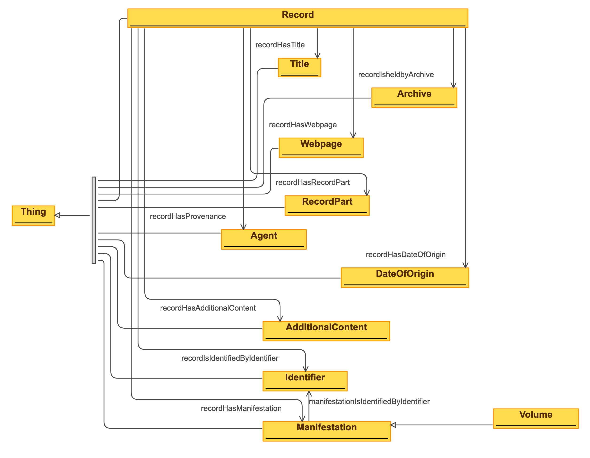

# Ontology archiving

| Predicate | Object |
|:-------- |:-------- |
| [rdf:type](http://www.w3.org/1999/02/22-rdf-syntax-ns#type) | [owl:Ontology](http://www.w3.org/2002/07/owl#Ontology); |
| [dct:license](http://purl.org/dc/terms/license) | <http://creativecommons.org/licenses/by/3.0/>; |
| [dct:title](http://purl.org/dc/terms/title) | "An ontology about archiving"@en; |
| [dct:description](http://purl.org/dc/terms/description) | """Formal description of a record, general subclasses, related classes and properties."""@en; |
| [dct:creator](http://purl.org/dc/terms/creator) | "Rebekka Plüss, research assistant and software developer, States Archive canton of Zürich"@en; |
| [dct:contributor](http://purl.org/dc/terms/contributor) | "Hans Cools, MD, knowledge engineer, ontologist, software developer, University of Basel, Switzerland"@en; |
| [dct:publisher](http://purl.org/dc/terms/publisher) | "States Archive canton of Zürich"@en; |
| [owl:versionInfo](http://www.w3.org/2002/07/owl#versionInfo) | "2021-11-05"^^xsd:date. |
# CLASSES
## Archive
| Predicate | Object |
|:-------- |:-------- |
| [rdfs:isDefinedBy](http://www.w3.org/2000/01/rdf-schema#isDefinedBy) | <https://github.com/stazh/sw-ehedaten/tree/main/ontology/archiving#>; |
| [rdf:type](http://www.w3.org/1999/02/22-rdf-syntax-ns#type) | [rdfs:Class](http://www.w3.org/2000/01/rdf-schema#Class); |
| [rdfs:label](http://www.w3.org/2000/01/rdf-schema#label) | "archive"@en, "Archiv"@de; |
| [rdfs:comment](http://www.w3.org/2000/01/rdf-schema#comment) | """Organization having a role of systematic collection, preservation, care and making accessible documents, objects etc. which hold information of the past. There are state archives which document the activities of the administration of the state, or there are archives that collect documents on specific topics - f.e. Social Archive or Women's Archive."""@en; |
| [rdfs:subClassOf](http://www.w3.org/2000/01/rdf-schema#subClassOf) | [organization:Archive](https://e-editiones.ch/ontology/organization#Archive). |
## Agent
| Predicate | Object |
|:-------- |:-------- |
| [rdfs:isDefinedBy](http://www.w3.org/2000/01/rdf-schema#isDefinedBy) | <https://github.com/stazh/sw-ehedaten/tree/main/ontology/archiving#>; |
| [rdf:type](http://www.w3.org/1999/02/22-rdf-syntax-ns#type) | [rdfs:Class](http://www.w3.org/2000/01/rdf-schema#Class); |
| [rdfs:label](http://www.w3.org/2000/01/rdf-schema#label) | "agent"@en, "Akteur"@de; |
| [rdfs:comment](http://www.w3.org/2000/01/rdf-schema#comment) | """Something, someone, ... performing in an action."""@en; |
| [rdfs:subClassOf](http://www.w3.org/2000/01/rdf-schema#subClassOf) | [agent:Agent](https://e-editiones.ch/ontology/agent#Agent), [rico:Agent](https://www.ica.org/standards/RiC/ontology#Agent). |
## Record
| Predicate | Object |
|:-------- |:-------- |
| [rdfs:isDefinedBy](http://www.w3.org/2000/01/rdf-schema#isDefinedBy) | <https://github.com/stazh/sw-ehedaten/tree/main/ontology/archiving#>; |
| [rdf:type](http://www.w3.org/1999/02/22-rdf-syntax-ns#type) | [rdfs:Class](http://www.w3.org/2000/01/rdf-schema#Class); |
| [rdfs:label](http://www.w3.org/2000/01/rdf-schema#label) | "record"@en, "Archivverzeichniseinheit"@de; |
| [rdfs:comment](http://www.w3.org/2000/01/rdf-schema#comment) | """A record as an entry in an Archive Information System with metadata, which describe physical archived things. A record is abstract."""@en; |
| [rdfs:subClassOf](http://www.w3.org/2000/01/rdf-schema#subClassOf) | [rico:Record](https://www.ica.org/standards/RiC/ontology#Record). |
## RecordPart
| Predicate | Object |
|:-------- |:-------- |
| [rdfs:isDefinedBy](http://www.w3.org/2000/01/rdf-schema#isDefinedBy) | <https://github.com/stazh/sw-ehedaten/tree/main/ontology/archiving#>; |
| [rdf:type](http://www.w3.org/1999/02/22-rdf-syntax-ns#type) | [rdfs:Class](http://www.w3.org/2000/01/rdf-schema#Class); |
| [rdfs:label](http://www.w3.org/2000/01/rdf-schema#label) | "record part"@en, "Archivverzeichniseinheit-Teil"@de; |
| [rdfs:comment](http://www.w3.org/2000/01/rdf-schema#comment) | """A record part as an entry in an Archive Information System with metadata, which describe parts of physicals archived things. A record part is abstract."""@en; |
| [rdfs:subClassOf](http://www.w3.org/2000/01/rdf-schema#subClassOf) | [rico:RecordPart](https://www.ica.org/standards/RiC/ontology#RecordPart). |
## Title
| Predicate | Object |
|:-------- |:-------- |
| [rdfs:isDefinedBy](http://www.w3.org/2000/01/rdf-schema#isDefinedBy) | <https://github.com/stazh/sw-ehedaten/tree/main/ontology/archiving#>; |
| [rdf:type](http://www.w3.org/1999/02/22-rdf-syntax-ns#type) | [rdfs:Class](http://www.w3.org/2000/01/rdf-schema#Class); |
| [rdfs:label](http://www.w3.org/2000/01/rdf-schema#label) | "title"@en, "Titel"@de; |
| [rdfs:comment](http://www.w3.org/2000/01/rdf-schema#comment) | """The title of the record or the record part."""@en; |
| [rdfs:subClassOf](http://www.w3.org/2000/01/rdf-schema#subClassOf) | [rico:Title](https://www.ica.org/standards/RiC/ontology#Title). |
## Manifestation
| Predicate | Object |
|:-------- |:-------- |
| [rdfs:isDefinedBy](http://www.w3.org/2000/01/rdf-schema#isDefinedBy) | <https://github.com/stazh/sw-ehedaten/tree/main/ontology/archiving#>; |
| [rdf:type](http://www.w3.org/1999/02/22-rdf-syntax-ns#type) | [rdfs:Class](http://www.w3.org/2000/01/rdf-schema#Class); |
| [rdfs:label](http://www.w3.org/2000/01/rdf-schema#label) | "manifestation"@en, "Ausprägung"@de; |
| [rdfs:comment](http://www.w3.org/2000/01/rdf-schema#comment) | """Carrier of information created by an agent with role provencance. The physical archived thing to which the record or the record part refers. A record or record part can refer to no manifestation, because it is lost or a record or record part can refer to more than one manifestation (f.e. if there exists a digital representation)."""@en; |
| [rdfs:subClassOf](http://www.w3.org/2000/01/rdf-schema#subClassOf) | [rico:Instantiation](https://www.ica.org/standards/RiC/ontology#Instantiation), [information-carrier:Carrier](https://e-editiones.ch/ontology/information-carrier#Carrier). |
## Volume
| Predicate | Object |
|:-------- |:-------- |
| [rdfs:isDefinedBy](http://www.w3.org/2000/01/rdf-schema#isDefinedBy) | <https://github.com/stazh/sw-ehedaten/tree/main/ontology/archiving#>; |
| [rdf:type](http://www.w3.org/1999/02/22-rdf-syntax-ns#type) | [rdfs:Class](http://www.w3.org/2000/01/rdf-schema#Class); |
| [rdfs:label](http://www.w3.org/2000/01/rdf-schema#label) | "volume"@en, "Band"@de; |
| [rdfs:comment](http://www.w3.org/2000/01/rdf-schema#comment) | """Volume as type of the carrier resp. the archival material type. It is also a special book: One book of a serie of books. One serie is a set of books which are mostly created for the same purpose by the same agent."""@en; |
| [rdfs:subClassOf](http://www.w3.org/2000/01/rdf-schema#subClassOf) | [archiving:Manifestation](https://github.com/stazh/sw-ehedaten/tree/main/ontology/archiving#Manifestation), [information-carrier:Volume](https://e-editiones.ch/ontology/information-carrier#Volume). |
## AdditionalContent
| Predicate | Object |
|:-------- |:-------- |
| [rdfs:isDefinedBy](http://www.w3.org/2000/01/rdf-schema#isDefinedBy) | <https://github.com/stazh/sw-ehedaten/tree/main/ontology/archiving#>; |
| [rdf:type](http://www.w3.org/1999/02/22-rdf-syntax-ns#type) | [rdfs:Class](http://www.w3.org/2000/01/rdf-schema#Class); |
| [rdfs:label](http://www.w3.org/2000/01/rdf-schema#label) | "additional content"@en, "Zusatzinformation"@de; |
| [rdfs:comment](http://www.w3.org/2000/01/rdf-schema#comment) | """Some further information about a record or record part. Can be of any kind."""@en. |
## Identifier
| Predicate | Object |
|:-------- |:-------- |
| [rdfs:isDefinedBy](http://www.w3.org/2000/01/rdf-schema#isDefinedBy) | <https://github.com/stazh/sw-ehedaten/tree/main/ontology/archiving#>; |
| [rdf:type](http://www.w3.org/1999/02/22-rdf-syntax-ns#type) | [rdfs:Class](http://www.w3.org/2000/01/rdf-schema#Class); |
| [rdfs:label](http://www.w3.org/2000/01/rdf-schema#label) | "identifier"@en, "Identifikator"@de; |
| [rdfs:comment](http://www.w3.org/2000/01/rdf-schema#comment) | """The identifying mark with which a record or an record part or manifestation of it can be clearly identified and referenced. In the context of an archive information system, this is usually the signature."""@en; |
| [rdfs:subClassOf](http://www.w3.org/2000/01/rdf-schema#subClassOf) | [rico:Identifier](https://www.ica.org/standards/RiC/ontology#Identifier). |
## DateOfOrigin
| Predicate | Object |
|:-------- |:-------- |
| [rdfs:isDefinedBy](http://www.w3.org/2000/01/rdf-schema#isDefinedBy) | <https://github.com/stazh/sw-ehedaten/tree/main/ontology/archiving#>; |
| [rdf:type](http://www.w3.org/1999/02/22-rdf-syntax-ns#type) | [rdfs:Class](http://www.w3.org/2000/01/rdf-schema#Class); |
| [rdfs:label](http://www.w3.org/2000/01/rdf-schema#label) | "date of origin"@en, "Entstehungszeitraum"@de; |
| [rdfs:comment](http://www.w3.org/2000/01/rdf-schema#comment) | """The date when the archived thing was originally created."""@en; |
| [rdfs:subClassOf](http://www.w3.org/2000/01/rdf-schema#subClassOf) | [rico:Date](https://www.ica.org/standards/RiC/ontology#Date). |
## Webpage
| Predicate | Object |
|:-------- |:-------- |
| [rdfs:isDefinedBy](http://www.w3.org/2000/01/rdf-schema#isDefinedBy) | <https://github.com/stazh/sw-ehedaten/tree/main/ontology/archiving#>; |
| [rdf:type](http://www.w3.org/1999/02/22-rdf-syntax-ns#type) | [rdfs:Class](http://www.w3.org/2000/01/rdf-schema#Class); |
| [rdfs:label](http://www.w3.org/2000/01/rdf-schema#label) | "webpage"@en, "Webseite"@de; |
| [rdfs:comment](http://www.w3.org/2000/01/rdf-schema#comment) | """Webpage of the record or record part in an archive information system."""@en; |
| [rdfs:subClassOf](http://www.w3.org/2000/01/rdf-schema#subClassOf) | [electronic-information:Webpage](https://e-editiones.ch/ontology/electronic-information#Webpage). |
## RecordPartReference
| Predicate | Object |
|:-------- |:-------- |
| [rdfs:isDefinedBy](http://www.w3.org/2000/01/rdf-schema#isDefinedBy) | <https://github.com/stazh/sw-ehedaten/tree/main/ontology/archiving#>; |
| [rdf:type](http://www.w3.org/1999/02/22-rdf-syntax-ns#type) | [rdfs:Class](http://www.w3.org/2000/01/rdf-schema#Class); |
| [rdfs:label](http://www.w3.org/2000/01/rdf-schema#label) | "record part reference"@en, "Archivverzeichniseinheit-Teil-Referenz"@de; |
| [rdfs:comment](http://www.w3.org/2000/01/rdf-schema#comment) | """A reference to a part of the manifestation of a record. This reference is described in the record part of a record. F.e. a record part has as manifestation a textline in a volume. And this volume is the manifestation of the record, of which the record part is part of. So in this example the record part reference is an information in the record part, which says, on which page of the volume the textline can be found."""@en; |
| [rdfs:subClassOf](http://www.w3.org/2000/01/rdf-schema#subClassOf) | [document:ContentStructureReference](https://e-editiones.ch/ontology/document#ContentStructureReference). |
# PROPERTIES
## recordHasRecordPart
| Predicate | Object |
|:-------- |:-------- |
| [rdfs:isDefinedBy](http://www.w3.org/2000/01/rdf-schema#isDefinedBy) | <https://github.com/stazh/sw-ehedaten/tree/main/ontology/archiving#>; |
| [rdf:type](http://www.w3.org/1999/02/22-rdf-syntax-ns#type) | [owl:ObjectProperty](http://www.w3.org/2002/07/owl#ObjectProperty); |
| [rdfs:label](http://www.w3.org/2000/01/rdf-schema#label) | "record has record part"@en, "Archivverzeichniseinheit hat Archivverzeichniseinheit-Teil"; |
| [rdfs:comment](http://www.w3.org/2000/01/rdf-schema#comment) | """Relating a record part to the record of which it is part of."""@en; |
| [rdfs:domain](http://www.w3.org/2000/01/rdf-schema#domain) | [archiving:Record](https://github.com/stazh/sw-ehedaten/tree/main/ontology/archiving#Record); |
| [rdfs:range](http://www.w3.org/2000/01/rdf-schema#range) | [archiving:RecordPart](https://github.com/stazh/sw-ehedaten/tree/main/ontology/archiving#RecordPart); |
| [rdfs:subPropertyOf](http://www.w3.org/2000/01/rdf-schema#subPropertyOf) | [rico:hasOrHadPart](https://www.ica.org/standards/RiC/ontology#hasOrHadPart). |
## recordHasManifestation
| Predicate | Object |
|:-------- |:-------- |
| [rdfs:isDefinedBy](http://www.w3.org/2000/01/rdf-schema#isDefinedBy) | <https://github.com/stazh/sw-ehedaten/tree/main/ontology/archiving#>; |
| [rdf:type](http://www.w3.org/1999/02/22-rdf-syntax-ns#type) | [owl:ObjectProperty](http://www.w3.org/2002/07/owl#ObjectProperty); |
| [rdfs:label](http://www.w3.org/2000/01/rdf-schema#label) | "record has manifestation"@en, "Archivverzeichniseinheit hat Ausprägung"; |
| [rdfs:comment](http://www.w3.org/2000/01/rdf-schema#comment) | """Relating a record to its manifestation."""@en; |
| [rdfs:domain](http://www.w3.org/2000/01/rdf-schema#domain) | [archiving:Record](https://github.com/stazh/sw-ehedaten/tree/main/ontology/archiving#Record); |
| [rdfs:range](http://www.w3.org/2000/01/rdf-schema#range) | [archiving:Manifestation](https://github.com/stazh/sw-ehedaten/tree/main/ontology/archiving#Manifestation); |
| [rdfs:subPropertyOf](http://www.w3.org/2000/01/rdf-schema#subPropertyOf) | [rico:hasInstantiation](https://www.ica.org/standards/RiC/ontology#hasInstantiation). |
## recordPartHasManifestation
| Predicate | Object |
|:-------- |:-------- |
| [rdfs:isDefinedBy](http://www.w3.org/2000/01/rdf-schema#isDefinedBy) | <https://github.com/stazh/sw-ehedaten/tree/main/ontology/archiving#>; |
| [rdf:type](http://www.w3.org/1999/02/22-rdf-syntax-ns#type) | [owl:ObjectProperty](http://www.w3.org/2002/07/owl#ObjectProperty); |
| [rdfs:label](http://www.w3.org/2000/01/rdf-schema#label) | "record part has manifestation"@en, "Archivverzeichniseinheit-Teil hat Ausprägung"; |
| [rdfs:comment](http://www.w3.org/2000/01/rdf-schema#comment) | """Relating a record part to its manifestation."""@en; |
| [rdfs:domain](http://www.w3.org/2000/01/rdf-schema#domain) | [archiving:RecordPart](https://github.com/stazh/sw-ehedaten/tree/main/ontology/archiving#RecordPart); |
| [rdfs:range](http://www.w3.org/2000/01/rdf-schema#range) | [archiving:Manifestation](https://github.com/stazh/sw-ehedaten/tree/main/ontology/archiving#Manifestation); |
| [rdfs:subPropertyOf](http://www.w3.org/2000/01/rdf-schema#subPropertyOf) | [rico:hasInstantiation](https://www.ica.org/standards/RiC/ontology#hasInstantiation). |
## recordHasTitle
| Predicate | Object |
|:-------- |:-------- |
| [rdfs:isDefinedBy](http://www.w3.org/2000/01/rdf-schema#isDefinedBy) | <https://github.com/stazh/sw-ehedaten/tree/main/ontology/archiving#>; |
| [rdf:type](http://www.w3.org/1999/02/22-rdf-syntax-ns#type) | [owl:ObjectProperty](http://www.w3.org/2002/07/owl#ObjectProperty); |
| [rdfs:label](http://www.w3.org/2000/01/rdf-schema#label) | "record has title"@en, "Archivverzeichniseinheit hat Titel"@de; |
| [rdfs:comment](http://www.w3.org/2000/01/rdf-schema#comment) | """Relating a record to its title."""@en; |
| [rdfs:domain](http://www.w3.org/2000/01/rdf-schema#domain) | [archiving:Record](https://github.com/stazh/sw-ehedaten/tree/main/ontology/archiving#Record); |
| [rdfs:range](http://www.w3.org/2000/01/rdf-schema#range) | [archiving:Title](https://github.com/stazh/sw-ehedaten/tree/main/ontology/archiving#Title); |
| [rdfs:subPropertyOf](http://www.w3.org/2000/01/rdf-schema#subPropertyOf) | [rico:hasOrHadTitle](https://www.ica.org/standards/RiC/ontology#hasOrHadTitle). |
## recordHasTitleLiteral
| Predicate | Object |
|:-------- |:-------- |
| [rdfs:isDefinedBy](http://www.w3.org/2000/01/rdf-schema#isDefinedBy) | <https://github.com/stazh/sw-ehedaten/tree/main/ontology/archiving#>; |
| [rdf:type](http://www.w3.org/1999/02/22-rdf-syntax-ns#type) | [owl:ObjectProperty](http://www.w3.org/2002/07/owl#ObjectProperty); |
| [rdfs:label](http://www.w3.org/2000/01/rdf-schema#label) | "record has title literal"@en, "Archivverzeichniseinheit hat Titelliteral"@de; |
| [rdfs:comment](http://www.w3.org/2000/01/rdf-schema#comment) | """Relating a record to its title literal."""@en; |
| [rdfs:domain](http://www.w3.org/2000/01/rdf-schema#domain) | [archiving:Record](https://github.com/stazh/sw-ehedaten/tree/main/ontology/archiving#Record); |
| [rdfs:range](http://www.w3.org/2000/01/rdf-schema#range) | [rdfs:Literal](http://www.w3.org/2000/01/rdf-schema#Literal); |
| [rdfs:subPropertyOf](http://www.w3.org/2000/01/rdf-schema#subPropertyOf) | [rico:title](https://www.ica.org/standards/RiC/ontology#title). |
## recordPartHasTitle
| Predicate | Object |
|:-------- |:-------- |
| [rdfs:isDefinedBy](http://www.w3.org/2000/01/rdf-schema#isDefinedBy) | <https://github.com/stazh/sw-ehedaten/tree/main/ontology/archiving#>; |
| [rdf:type](http://www.w3.org/1999/02/22-rdf-syntax-ns#type) | [owl:ObjectProperty](http://www.w3.org/2002/07/owl#ObjectProperty); |
| [rdfs:label](http://www.w3.org/2000/01/rdf-schema#label) | "record part has title"@en, "Archivverzeichniseinheit-Teil hat Titel"@de; |
| [rdfs:comment](http://www.w3.org/2000/01/rdf-schema#comment) | """Relating a record part to its title."""@en; |
| [rdfs:domain](http://www.w3.org/2000/01/rdf-schema#domain) | [archiving:RecordPart](https://github.com/stazh/sw-ehedaten/tree/main/ontology/archiving#RecordPart); |
| [rdfs:range](http://www.w3.org/2000/01/rdf-schema#range) | [archiving:Title](https://github.com/stazh/sw-ehedaten/tree/main/ontology/archiving#Title); |
| [rdfs:subPropertyOf](http://www.w3.org/2000/01/rdf-schema#subPropertyOf) | [rico:hasOrHadTitle.](https://www.ica.org/standards/RiC/ontology#hasOrHadTitle.)  |
## recordPartHasTitleLiteral
| Predicate | Object |
|:-------- |:-------- |
| [rdfs:isDefinedBy](http://www.w3.org/2000/01/rdf-schema#isDefinedBy) | <https://github.com/stazh/sw-ehedaten/tree/main/ontology/archiving#>; |
| [rdf:type](http://www.w3.org/1999/02/22-rdf-syntax-ns#type) | [owl:ObjectProperty](http://www.w3.org/2002/07/owl#ObjectProperty); |
| [rdfs:label](http://www.w3.org/2000/01/rdf-schema#label) | "record part has title literal"@en, "Archivverzeichniseinheit-Teil hat Titelliteral"@de; |
| [rdfs:comment](http://www.w3.org/2000/01/rdf-schema#comment) | """Relating a record part to its title literal."""@en; |
| [rdfs:domain](http://www.w3.org/2000/01/rdf-schema#domain) | [archiving:RecordPart](https://github.com/stazh/sw-ehedaten/tree/main/ontology/archiving#RecordPart); |
| [rdfs:range](http://www.w3.org/2000/01/rdf-schema#range) | [rdfs:Literal](http://www.w3.org/2000/01/rdf-schema#Literal); |
| [rdfs:subPropertyOf](http://www.w3.org/2000/01/rdf-schema#subPropertyOf) | [rico:title](https://www.ica.org/standards/RiC/ontology#title). |
## titleHasLiteral
| Predicate | Object |
|:-------- |:-------- |
| [rdfs:isDefinedBy](http://www.w3.org/2000/01/rdf-schema#isDefinedBy) | <https://github.com/stazh/sw-ehedaten/tree/main/ontology/archiving#>; |
| [rdf:type](http://www.w3.org/1999/02/22-rdf-syntax-ns#type) | [owl:ObjectProperty](http://www.w3.org/2002/07/owl#ObjectProperty); |
| [rdfs:label](http://www.w3.org/2000/01/rdf-schema#label) | "title has literal"@en, "Titel hat Literal"; |
| [rdfs:comment](http://www.w3.org/2000/01/rdf-schema#comment) | """Relating a title to its literal."""@en; |
| [rdfs:domain](http://www.w3.org/2000/01/rdf-schema#domain) | [archiving:Title](https://github.com/stazh/sw-ehedaten/tree/main/ontology/archiving#Title); |
| [rdfs:range](http://www.w3.org/2000/01/rdf-schema#range) | [rdfs:Literal](http://www.w3.org/2000/01/rdf-schema#Literal). |
## recordHasDateOfOrigin
| Predicate | Object |
|:-------- |:-------- |
| [rdfs:isDefinedBy](http://www.w3.org/2000/01/rdf-schema#isDefinedBy) | <https://github.com/stazh/sw-ehedaten/tree/main/ontology/archiving#>; |
| [rdf:type](http://www.w3.org/1999/02/22-rdf-syntax-ns#type) | [owl:ObjectProperty](http://www.w3.org/2002/07/owl#ObjectProperty); |
| [rdfs:label](http://www.w3.org/2000/01/rdf-schema#label) | "record has date of origin"@en, "Archivverzeichniseinheit hat Entstehungszeitraum"@de; |
| [rdfs:comment](http://www.w3.org/2000/01/rdf-schema#comment) | """Relating a date of origin to a record."""@en; |
| [rdfs:domain](http://www.w3.org/2000/01/rdf-schema#domain) | [archiving:Record](https://github.com/stazh/sw-ehedaten/tree/main/ontology/archiving#Record); |
| [rdfs:range](http://www.w3.org/2000/01/rdf-schema#range) | [archiving:DateOfOrigin](https://github.com/stazh/sw-ehedaten/tree/main/ontology/archiving#DateOfOrigin); |
| [rdfs:subPropertyOf](http://www.w3.org/2000/01/rdf-schema#subPropertyOf) | [rico:hasBeginningDate](https://www.ica.org/standards/RiC/ontology#hasBeginningDate). |
## recordPartHasDateOfOrigin
| Predicate | Object |
|:-------- |:-------- |
| [rdfs:isDefinedBy](http://www.w3.org/2000/01/rdf-schema#isDefinedBy) | <https://github.com/stazh/sw-ehedaten/tree/main/ontology/archiving#>; |
| [rdf:type](http://www.w3.org/1999/02/22-rdf-syntax-ns#type) | [owl:ObjectProperty](http://www.w3.org/2002/07/owl#ObjectProperty); |
| [rdfs:label](http://www.w3.org/2000/01/rdf-schema#label) | "record part has dat of origin"@en, "Archivverzeichniseinheitteil hat Entstehungszeitraum"@de; |
| [rdfs:comment](http://www.w3.org/2000/01/rdf-schema#comment) | """Relating a date of origin to a record part."""@en; |
| [rdfs:domain](http://www.w3.org/2000/01/rdf-schema#domain) | [archiving:RecordPart](https://github.com/stazh/sw-ehedaten/tree/main/ontology/archiving#RecordPart); |
| [rdfs:range](http://www.w3.org/2000/01/rdf-schema#range) | [archiving:DateOfOrigin](https://github.com/stazh/sw-ehedaten/tree/main/ontology/archiving#DateOfOrigin); |
| [rdfs:subPropertyOf](http://www.w3.org/2000/01/rdf-schema#subPropertyOf) | [rico:hasBeginningDate](https://www.ica.org/standards/RiC/ontology#hasBeginningDate). |
## dateOfOriginHasLiteral
| Predicate | Object |
|:-------- |:-------- |
| [rdfs:isDefinedBy](http://www.w3.org/2000/01/rdf-schema#isDefinedBy) | <https://github.com/stazh/sw-ehedaten/tree/main/ontology/archiving#>; |
| [rdf:type](http://www.w3.org/1999/02/22-rdf-syntax-ns#type) | [owl:ObjectProperty](http://www.w3.org/2002/07/owl#ObjectProperty); |
| [rdfs:label](http://www.w3.org/2000/01/rdf-schema#label) | "date of origin has literal"@en, "Entstehungszeitraum hat Literal"; |
| [rdfs:comment](http://www.w3.org/2000/01/rdf-schema#comment) | """Relating a date of origin to its literal."""@en; |
| [rdfs:domain](http://www.w3.org/2000/01/rdf-schema#domain) | [archiving:Title](https://github.com/stazh/sw-ehedaten/tree/main/ontology/archiving#Title); |
| [rdfs:range](http://www.w3.org/2000/01/rdf-schema#range) | [rdfs:Literal](http://www.w3.org/2000/01/rdf-schema#Literal); |
| [rdfs:subPropertyOf](http://www.w3.org/2000/01/rdf-schema#subPropertyOf) | [rico:creationDate](https://www.ica.org/standards/RiC/ontology#creationDate). |
## recordHasdateOfOriginLiteral
| Predicate | Object |
|:-------- |:-------- |
| [rdfs:isDefinedBy](http://www.w3.org/2000/01/rdf-schema#isDefinedBy) | <https://github.com/stazh/sw-ehedaten/tree/main/ontology/archiving#>; |
| [rdf:type](http://www.w3.org/1999/02/22-rdf-syntax-ns#type) | [owl:ObjectProperty](http://www.w3.org/2002/07/owl#ObjectProperty); |
| [rdfs:label](http://www.w3.org/2000/01/rdf-schema#label) | "record has date of origin literal"@en, "Archivverzeichniseinheit hat Entstehungszeitraum-Literal"; |
| [rdfs:comment](http://www.w3.org/2000/01/rdf-schema#comment) | """Relating a record to the date of origin literal."""@en; |
| [rdfs:domain](http://www.w3.org/2000/01/rdf-schema#domain) | [archiving:Record](https://github.com/stazh/sw-ehedaten/tree/main/ontology/archiving#Record); |
| [rdfs:range](http://www.w3.org/2000/01/rdf-schema#range) | [rdfs:Literal](http://www.w3.org/2000/01/rdf-schema#Literal); |
| [rdfs:subPropertyOf](http://www.w3.org/2000/01/rdf-schema#subPropertyOf) | [rico:creationDate](https://www.ica.org/standards/RiC/ontology#creationDate). |
## recordPartHasdateOfOriginLiteral
| Predicate | Object |
|:-------- |:-------- |
| [rdfs:isDefinedBy](http://www.w3.org/2000/01/rdf-schema#isDefinedBy) | <https://github.com/stazh/sw-ehedaten/tree/main/ontology/archiving#>; |
| [rdf:type](http://www.w3.org/1999/02/22-rdf-syntax-ns#type) | [owl:ObjectProperty](http://www.w3.org/2002/07/owl#ObjectProperty); |
| [rdfs:label](http://www.w3.org/2000/01/rdf-schema#label) | "record part has date of origin literal"@en, "Archivverzeichniseinheit-Teil hat Entstehungszeitraum-Literal"; |
| [rdfs:comment](http://www.w3.org/2000/01/rdf-schema#comment) | """Relating a record part to the date of origin literal."""@en; |
| [rdfs:domain](http://www.w3.org/2000/01/rdf-schema#domain) | [archiving:RecordPart](https://github.com/stazh/sw-ehedaten/tree/main/ontology/archiving#RecordPart); |
| [rdfs:range](http://www.w3.org/2000/01/rdf-schema#range) | [rdfs:Literal](http://www.w3.org/2000/01/rdf-schema#Literal); |
| [rdfs:subPropertyOf](http://www.w3.org/2000/01/rdf-schema#subPropertyOf) | [rico:creationDate](https://www.ica.org/standards/RiC/ontology#creationDate). |
## recordIsIdentifiedByIdentifier 
| Predicate | Object |
|:-------- |:-------- |
| [rdfs:isDefinedBy](http://www.w3.org/2000/01/rdf-schema#isDefinedBy) | <https://github.com/stazh/sw-ehedaten/tree/main/ontology/archiving#>; |
| [rdf:type](http://www.w3.org/1999/02/22-rdf-syntax-ns#type) | [owl:ObjectProperty](http://www.w3.org/2002/07/owl#ObjectProperty); |
| [rdfs:label](http://www.w3.org/2000/01/rdf-schema#label) | "record is identified by identifier"@en, "Archivverzeichniseinheit wird identifiziert mit Identifikator."@de; |
| [rdfs:comment](http://www.w3.org/2000/01/rdf-schema#comment) | """Relating a record to its identifier."""@en; |
| [rdfs:domain](http://www.w3.org/2000/01/rdf-schema#domain) | [archiving:Record](https://github.com/stazh/sw-ehedaten/tree/main/ontology/archiving#Record); |
| [rdfs:range](http://www.w3.org/2000/01/rdf-schema#range) | [archiving:Identifier](https://github.com/stazh/sw-ehedaten/tree/main/ontology/archiving#Identifier). |
## recordPartIsIdentifiedByIdentifier 
| Predicate | Object |
|:-------- |:-------- |
| [rdfs:isDefinedBy](http://www.w3.org/2000/01/rdf-schema#isDefinedBy) | <https://github.com/stazh/sw-ehedaten/tree/main/ontology/archiving#>; |
| [rdf:type](http://www.w3.org/1999/02/22-rdf-syntax-ns#type) | [owl:ObjectProperty](http://www.w3.org/2002/07/owl#ObjectProperty); |
| [rdfs:label](http://www.w3.org/2000/01/rdf-schema#label) | "record part is identified by identifier"@en, "Archivverzeichniseinheiteil wird identifiziert mit Identifikator."@de; |
| [rdfs:comment](http://www.w3.org/2000/01/rdf-schema#comment) | """Relating the record part to its identifier."""@en; |
| [rdfs:domain](http://www.w3.org/2000/01/rdf-schema#domain) | [archiving:RecordPart](https://github.com/stazh/sw-ehedaten/tree/main/ontology/archiving#RecordPart); |
| [rdfs:range](http://www.w3.org/2000/01/rdf-schema#range) | [archiving:Identifier](https://github.com/stazh/sw-ehedaten/tree/main/ontology/archiving#Identifier). |
## manifestationIsIdentifiedByIdentifier 
| Predicate | Object |
|:-------- |:-------- |
| [rdfs:isDefinedBy](http://www.w3.org/2000/01/rdf-schema#isDefinedBy) | <https://github.com/stazh/sw-ehedaten/tree/main/ontology/archiving#>; |
| [rdf:type](http://www.w3.org/1999/02/22-rdf-syntax-ns#type) | [owl:ObjectProperty](http://www.w3.org/2002/07/owl#ObjectProperty); |
| [rdfs:label](http://www.w3.org/2000/01/rdf-schema#label) | "manifestation is identified by identifier"@en, "Ausprägung wird identifiziert mit Identifikator."@de; |
| [rdfs:comment](http://www.w3.org/2000/01/rdf-schema#comment) | """Relating the manifestation to its identifier."""@en; |
| [rdfs:domain](http://www.w3.org/2000/01/rdf-schema#domain) | [archiving:Manifestation](https://github.com/stazh/sw-ehedaten/tree/main/ontology/archiving#Manifestation); |
| [rdfs:range](http://www.w3.org/2000/01/rdf-schema#range) | [archiving:Identifier](https://github.com/stazh/sw-ehedaten/tree/main/ontology/archiving#Identifier). |
## identifierHasLiteral
| Predicate | Object |
|:-------- |:-------- |
| [rdfs:isDefinedBy](http://www.w3.org/2000/01/rdf-schema#isDefinedBy) | <https://github.com/stazh/sw-ehedaten/tree/main/ontology/archiving#>; |
| [rdf:type](http://www.w3.org/1999/02/22-rdf-syntax-ns#type) | [owl:ObjectProperty](http://www.w3.org/2002/07/owl#ObjectProperty); |
| [rdfs:label](http://www.w3.org/2000/01/rdf-schema#label) | "identifier has literal"@en, "Identifikator hat Literal"; |
| [rdfs:comment](http://www.w3.org/2000/01/rdf-schema#comment) | """Relating an identifier to its literal."""@en; |
| [rdfs:domain](http://www.w3.org/2000/01/rdf-schema#domain) | [archiving:Identifier](https://github.com/stazh/sw-ehedaten/tree/main/ontology/archiving#Identifier); |
| [rdfs:range](http://www.w3.org/2000/01/rdf-schema#range) | [rdfs:Literal](http://www.w3.org/2000/01/rdf-schema#Literal). |
## recordIsheldbyArchive
| Predicate | Object |
|:-------- |:-------- |
| [rdfs:isDefinedBy](http://www.w3.org/2000/01/rdf-schema#isDefinedBy) | <https://github.com/stazh/sw-ehedaten/tree/main/ontology/archiving#>; |
| [rdf:type](http://www.w3.org/1999/02/22-rdf-syntax-ns#type) | [owl:ObjectProperty](http://www.w3.org/2002/07/owl#ObjectProperty); |
| [rdfs:label](http://www.w3.org/2000/01/rdf-schema#label) | "record is held by archive"@en, "Archivverzeichniseinheit ist verzeichnet in Archiv"; |
| [rdfs:comment](http://www.w3.org/2000/01/rdf-schema#comment) | """Relating a record to its archive in which it is recorded and most commonly also in which the manifestation of the record is stored."""@en; |
| [rdfs:domain](http://www.w3.org/2000/01/rdf-schema#domain) | [archiving:Record](https://github.com/stazh/sw-ehedaten/tree/main/ontology/archiving#Record); |
| [rdfs:range](http://www.w3.org/2000/01/rdf-schema#range) | [archiving:Archive](https://github.com/stazh/sw-ehedaten/tree/main/ontology/archiving#Archive). |
## archiveHasNameLiteral
| Predicate | Object |
|:-------- |:-------- |
| [rdfs:isDefinedBy](http://www.w3.org/2000/01/rdf-schema#isDefinedBy) | <https://github.com/stazh/sw-ehedaten/tree/main/ontology/archiving#>; |
| [rdf:type](http://www.w3.org/1999/02/22-rdf-syntax-ns#type) | [owl:ObjectProperty](http://www.w3.org/2002/07/owl#ObjectProperty); |
| [rdfs:label](http://www.w3.org/2000/01/rdf-schema#label) | "archive has name literal"@en, "Archiv hat Namenliteral"; |
| [rdfs:comment](http://www.w3.org/2000/01/rdf-schema#comment) | """Relating an archive to its name literal."""@en; |
| [rdfs:domain](http://www.w3.org/2000/01/rdf-schema#domain) | [archiving:Archive](https://github.com/stazh/sw-ehedaten/tree/main/ontology/archiving#Archive); |
| [rdfs:range](http://www.w3.org/2000/01/rdf-schema#range) | [rdfs:Literal](http://www.w3.org/2000/01/rdf-schema#Literal). |
## recordHasProvenance
| Predicate | Object |
|:-------- |:-------- |
| [rdfs:isDefinedBy](http://www.w3.org/2000/01/rdf-schema#isDefinedBy) | <https://github.com/stazh/sw-ehedaten/tree/main/ontology/archiving#>; |
| [rdf:type](http://www.w3.org/1999/02/22-rdf-syntax-ns#type) | [owl:ObjectProperty](http://www.w3.org/2002/07/owl#ObjectProperty); |
| [rdfs:label](http://www.w3.org/2000/01/rdf-schema#label) | "record has provenance"@en, "Archivverzeichniseinheit hat Provenienz"; |
| [rdfs:comment](http://www.w3.org/2000/01/rdf-schema#comment) | """Relating a record to the agent which holds the role provenance for it. Provenance is the role of an agent (f.e. organization, person), which created the manifestation of the record originally for its own purposes."""@en; |
| [rdfs:domain](http://www.w3.org/2000/01/rdf-schema#domain) | [archiving:Record](https://github.com/stazh/sw-ehedaten/tree/main/ontology/archiving#Record); |
| [rdfs:range](http://www.w3.org/2000/01/rdf-schema#range) | [archiving:Agent](https://github.com/stazh/sw-ehedaten/tree/main/ontology/archiving#Agent); |
| [rdfs:subPropertyOf](http://www.w3.org/2000/01/rdf-schema#subPropertyOf) | [rico:hasProvenance](https://www.ica.org/standards/RiC/ontology#hasProvenance). |
## recordPartHasProvenance
| Predicate | Object |
|:-------- |:-------- |
| [rdfs:isDefinedBy](http://www.w3.org/2000/01/rdf-schema#isDefinedBy) | <https://github.com/stazh/sw-ehedaten/tree/main/ontology/archiving#>; |
| [rdf:type](http://www.w3.org/1999/02/22-rdf-syntax-ns#type) | [owl:ObjectProperty](http://www.w3.org/2002/07/owl#ObjectProperty); |
| [rdfs:label](http://www.w3.org/2000/01/rdf-schema#label) | "record part has provenance"@en, "Archivverzeichniseinheitteil hat Provenienz"; |
| [rdfs:comment](http://www.w3.org/2000/01/rdf-schema#comment) | """Relating a record part to the agent which holds the role provenance for it. Provenance is the role of an agent (f.e. organization, person), which created the manifestation of the record part originally for its own purposes."""@en; |
| [rdfs:domain](http://www.w3.org/2000/01/rdf-schema#domain) | [archiving:RecordPart](https://github.com/stazh/sw-ehedaten/tree/main/ontology/archiving#RecordPart); |
| [rdfs:range](http://www.w3.org/2000/01/rdf-schema#range) | [archiving:Agent](https://github.com/stazh/sw-ehedaten/tree/main/ontology/archiving#Agent); |
| [rdfs:subPropertyOf](http://www.w3.org/2000/01/rdf-schema#subPropertyOf) | [rico:hasProvenance](https://www.ica.org/standards/RiC/ontology#hasProvenance). |
## agentHasNameLiteral
| Predicate | Object |
|:-------- |:-------- |
| [rdfs:isDefinedBy](http://www.w3.org/2000/01/rdf-schema#isDefinedBy) | <https://github.com/stazh/sw-ehedaten/tree/main/ontology/archiving#>; |
| [rdf:type](http://www.w3.org/1999/02/22-rdf-syntax-ns#type) | [owl:ObjectProperty](http://www.w3.org/2002/07/owl#ObjectProperty); |
| [rdfs:label](http://www.w3.org/2000/01/rdf-schema#label) | "agent has name literal"@en, "Akteur hat Namenliteral"; |
| [rdfs:comment](http://www.w3.org/2000/01/rdf-schema#comment) | """Relating an agent to the literal of its name."""@en; |
| [rdfs:domain](http://www.w3.org/2000/01/rdf-schema#domain) | [archiving:Agent](https://github.com/stazh/sw-ehedaten/tree/main/ontology/archiving#Agent); |
| [rdfs:range](http://www.w3.org/2000/01/rdf-schema#range) | [rdfs:Literal](http://www.w3.org/2000/01/rdf-schema#Literal). |
## referenceHasLiteral
| Predicate | Object |
|:-------- |:-------- |
| [rdfs:isDefinedBy](http://www.w3.org/2000/01/rdf-schema#isDefinedBy) | <https://github.com/stazh/sw-ehedaten/tree/main/ontology/archiving#>; |
| [rdf:type](http://www.w3.org/1999/02/22-rdf-syntax-ns#type) | [owl:ObjectProperty](http://www.w3.org/2002/07/owl#ObjectProperty); |
| [rdfs:label](http://www.w3.org/2000/01/rdf-schema#label) | "reference has name literal"@en, "Referenz hat Literal"; |
| [rdfs:comment](http://www.w3.org/2000/01/rdf-schema#comment) | """Relating a reference to its literal."""@en; |
| [rdfs:domain](http://www.w3.org/2000/01/rdf-schema#domain) | [archiving:Reference](https://github.com/stazh/sw-ehedaten/tree/main/ontology/archiving#Reference); |
| [rdfs:range](http://www.w3.org/2000/01/rdf-schema#range) | [rdfs:Literal](http://www.w3.org/2000/01/rdf-schema#Literal). |
## recordHasWebpage
| Predicate | Object |
|:-------- |:-------- |
| [rdfs:isDefinedBy](http://www.w3.org/2000/01/rdf-schema#isDefinedBy) | <https://github.com/stazh/sw-ehedaten/tree/main/ontology/archiving#>; |
| [rdf:type](http://www.w3.org/1999/02/22-rdf-syntax-ns#type) | [owl:ObjectProperty](http://www.w3.org/2002/07/owl#ObjectProperty); |
| [rdfs:label](http://www.w3.org/2000/01/rdf-schema#label) | "record has webpage"@en, "Archivverzeichniseinheit hat Webseite"; |
| [rdfs:comment](http://www.w3.org/2000/01/rdf-schema#comment) | """Relating a record to the webpage of the entry in an archive information system."""@en; |
| [rdfs:domain](http://www.w3.org/2000/01/rdf-schema#domain) | [archiving:Record](https://github.com/stazh/sw-ehedaten/tree/main/ontology/archiving#Record); |
| [rdfs:range](http://www.w3.org/2000/01/rdf-schema#range) | [archiving:Webpage](https://github.com/stazh/sw-ehedaten/tree/main/ontology/archiving#Webpage). |
## recordPartHasWebpage
| Predicate | Object |
|:-------- |:-------- |
| [rdfs:isDefinedBy](http://www.w3.org/2000/01/rdf-schema#isDefinedBy) | <https://github.com/stazh/sw-ehedaten/tree/main/ontology/archiving#>; |
| [rdf:type](http://www.w3.org/1999/02/22-rdf-syntax-ns#type) | [owl:ObjectProperty](http://www.w3.org/2002/07/owl#ObjectProperty); |
| [rdfs:label](http://www.w3.org/2000/01/rdf-schema#label) | "record part has webpage"@en, "Archivverzeichniseinheitteil hat Webseite"; |
| [rdfs:comment](http://www.w3.org/2000/01/rdf-schema#comment) | """Relating a record part to the webpage of the entry in an archive information system."""@en; |
| [rdfs:domain](http://www.w3.org/2000/01/rdf-schema#domain) | [archiving:RecordPart](https://github.com/stazh/sw-ehedaten/tree/main/ontology/archiving#RecordPart); |
| [rdfs:range](http://www.w3.org/2000/01/rdf-schema#range) | [archiving:Webpage](https://github.com/stazh/sw-ehedaten/tree/main/ontology/archiving#Webpage). |
## webpageHasURL
| Predicate | Object |
|:-------- |:-------- |
| [rdfs:isDefinedBy](http://www.w3.org/2000/01/rdf-schema#isDefinedBy) | <https://github.com/stazh/sw-ehedaten/tree/main/ontology/archiving#>; |
| [rdf:type](http://www.w3.org/1999/02/22-rdf-syntax-ns#type) | [owl:ObjectProperty](http://www.w3.org/2002/07/owl#ObjectProperty); |
| [rdfs:label](http://www.w3.org/2000/01/rdf-schema#label) | "webpage has URL"@en, "Webseite hat URL"; |
| [rdfs:comment](http://www.w3.org/2000/01/rdf-schema#comment) | """Relating a webpage to its URL."""@en; |
| [rdfs:domain](http://www.w3.org/2000/01/rdf-schema#domain) | [archiving:Webpage](https://github.com/stazh/sw-ehedaten/tree/main/ontology/archiving#Webpage); |
| [rdfs:range](http://www.w3.org/2000/01/rdf-schema#range) | [xsd:anyURI](http://www.w3.org/2001/XMLSchema#anyURI); |
| [rdfs:subPropertyOf](http://www.w3.org/2000/01/rdf-schema#subPropertyOf) | [electronic-information:webpageHasURL](https://e-editiones.ch/ontology/electronic-information#webpageHasURL). |
## recordHasAdditionalContent
| Predicate | Object |
|:-------- |:-------- |
| [rdfs:isDefinedBy](http://www.w3.org/2000/01/rdf-schema#isDefinedBy) | <https://github.com/stazh/sw-ehedaten/tree/main/ontology/archiving#>; |
| [rdf:type](http://www.w3.org/1999/02/22-rdf-syntax-ns#type) | [owl:ObjectProperty](http://www.w3.org/2002/07/owl#ObjectProperty); |
| [rdfs:label](http://www.w3.org/2000/01/rdf-schema#label) | "record has additional content"@en, "Archivverzeichniseinheit hat Zusatzinformation"; |
| [rdfs:comment](http://www.w3.org/2000/01/rdf-schema#comment) | """Relating a record to the some further information about it, which can be of any kind."""@en; |
| [rdfs:domain](http://www.w3.org/2000/01/rdf-schema#domain) | [archiving:Record](https://github.com/stazh/sw-ehedaten/tree/main/ontology/archiving#Record); |
| [rdfs:range](http://www.w3.org/2000/01/rdf-schema#range) | [archiving:AdditionalContent](https://github.com/stazh/sw-ehedaten/tree/main/ontology/archiving#AdditionalContent). |
## recordPartHasAdditionalContent
| Predicate | Object |
|:-------- |:-------- |
| [rdfs:isDefinedBy](http://www.w3.org/2000/01/rdf-schema#isDefinedBy) | <https://github.com/stazh/sw-ehedaten/tree/main/ontology/archiving#>; |
| [rdf:type](http://www.w3.org/1999/02/22-rdf-syntax-ns#type) | [owl:ObjectProperty](http://www.w3.org/2002/07/owl#ObjectProperty); |
| [rdfs:label](http://www.w3.org/2000/01/rdf-schema#label) | "record part has additional content"@en, "Archivverzeichniseinheitteil hat Zusatzinformation"; |
| [rdfs:comment](http://www.w3.org/2000/01/rdf-schema#comment) | """Relating a record part to the some further information about it, which can be of any kind."""@en; |
| [rdfs:domain](http://www.w3.org/2000/01/rdf-schema#domain) | [archiving:RecordPart](https://github.com/stazh/sw-ehedaten/tree/main/ontology/archiving#RecordPart); |
| [rdfs:range](http://www.w3.org/2000/01/rdf-schema#range) | [archiving:AdditionalContent](https://github.com/stazh/sw-ehedaten/tree/main/ontology/archiving#AdditionalContent). |
## additionalContentHasLiteral
| Predicate | Object |
|:-------- |:-------- |
| [rdfs:isDefinedBy](http://www.w3.org/2000/01/rdf-schema#isDefinedBy) | <https://github.com/stazh/sw-ehedaten/tree/main/ontology/archiving#>; |
| [rdf:type](http://www.w3.org/1999/02/22-rdf-syntax-ns#type) | [owl:ObjectProperty](http://www.w3.org/2002/07/owl#ObjectProperty); |
| [rdfs:label](http://www.w3.org/2000/01/rdf-schema#label) | "additional content has name literal"@en, "Zusatzinformation hat Literal"; |
| [rdfs:comment](http://www.w3.org/2000/01/rdf-schema#comment) | """Relating additional content to its literal."""@en; |
| [rdfs:domain](http://www.w3.org/2000/01/rdf-schema#domain) | [archiving:AdditionalContent](https://github.com/stazh/sw-ehedaten/tree/main/ontology/archiving#AdditionalContent); |
| [rdfs:range](http://www.w3.org/2000/01/rdf-schema#range) | [rdfs:Literal](http://www.w3.org/2000/01/rdf-schema#Literal). |
## isRepresentedByRecord
| Predicate | Object |
|:-------- |:-------- |
| [rdfs:isDefinedBy](http://www.w3.org/2000/01/rdf-schema#isDefinedBy) | <https://github.com/stazh/sw-ehedaten/tree/main/ontology/archiving#>; |
| [rdf:type](http://www.w3.org/1999/02/22-rdf-syntax-ns#type) | [owl:ObjectProperty](http://www.w3.org/2002/07/owl#ObjectProperty); |
| [rdfs:label](http://www.w3.org/2000/01/rdf-schema#label) | "is represented by record"@en, "wird durch Archivverzeichniseinheit dargestellt"; |
| [rdfs:comment](http://www.w3.org/2000/01/rdf-schema#comment) | """Relating something in the world (an event, a thing...) to the record it is represented by."""@en; |
| [rdfs:domain](http://www.w3.org/2000/01/rdf-schema#domain) | [rdfs:Resource](http://www.w3.org/2000/01/rdf-schema#Resource); |
| [rdfs:range](http://www.w3.org/2000/01/rdf-schema#range) | [archiving:Record](https://github.com/stazh/sw-ehedaten/tree/main/ontology/archiving#Record); |
| [owl:inverseOf](http://www.w3.org/2002/07/owl#inverseOf) | [archiving:recordRepresents](https://github.com/stazh/sw-ehedaten/tree/main/ontology/archiving#recordRepresents). |
## isRepresentedByRecordPart
| Predicate | Object |
|:-------- |:-------- |
| [rdfs:isDefinedBy](http://www.w3.org/2000/01/rdf-schema#isDefinedBy) | <https://github.com/stazh/sw-ehedaten/tree/main/ontology/archiving#>; |
| [rdf:type](http://www.w3.org/1999/02/22-rdf-syntax-ns#type) | [owl:ObjectProperty](http://www.w3.org/2002/07/owl#ObjectProperty); |
| [rdfs:label](http://www.w3.org/2000/01/rdf-schema#label) | "is represented by record part"@en, "wird durch Archivverzeichniseinheitteil dargestellt"; |
| [rdfs:comment](http://www.w3.org/2000/01/rdf-schema#comment) | """Relating something in the world (an event, a thing...) to the record part it is represented by."""@en; |
| [rdfs:domain](http://www.w3.org/2000/01/rdf-schema#domain) | [rdfs:Resource](http://www.w3.org/2000/01/rdf-schema#Resource); |
| [rdfs:range](http://www.w3.org/2000/01/rdf-schema#range) | [archiving:RecordPart](https://github.com/stazh/sw-ehedaten/tree/main/ontology/archiving#RecordPart); |
| [owl:inverseOf](http://www.w3.org/2002/07/owl#inverseOf) | [archiving:recordPartRepresents](https://github.com/stazh/sw-ehedaten/tree/main/ontology/archiving#recordPartRepresents). |
## recordRepresents
| Predicate | Object |
|:-------- |:-------- |
| [rdfs:isDefinedBy](http://www.w3.org/2000/01/rdf-schema#isDefinedBy) | <https://github.com/stazh/sw-ehedaten/tree/main/ontology/archiving#>; |
| [rdf:type](http://www.w3.org/1999/02/22-rdf-syntax-ns#type) | [owl:ObjectProperty](http://www.w3.org/2002/07/owl#ObjectProperty); |
| [rdfs:label](http://www.w3.org/2000/01/rdf-schema#label) | "record represents"@en, "Archivverzeichniseinheit stellt dar"@de; |
| [rdfs:comment](http://www.w3.org/2000/01/rdf-schema#comment) | """Relating an record to what (an event, a thing...) it represents."""@en; |
| [rdfs:domain](http://www.w3.org/2000/01/rdf-schema#domain) | [archiving:Record](https://github.com/stazh/sw-ehedaten/tree/main/ontology/archiving#Record); |
| [rdfs:range](http://www.w3.org/2000/01/rdf-schema#range) | [rdfs:Resource](http://www.w3.org/2000/01/rdf-schema#Resource); |
| [owl:inverseOf](http://www.w3.org/2002/07/owl#inverseOf) | [archiving:isRepresentedByRecord](https://github.com/stazh/sw-ehedaten/tree/main/ontology/archiving#isRepresentedByRecord). |
## recordPartRepresents
| Predicate | Object |
|:-------- |:-------- |
| [rdfs:isDefinedBy](http://www.w3.org/2000/01/rdf-schema#isDefinedBy) | <https://github.com/stazh/sw-ehedaten/tree/main/ontology/archiving#>; |
| [rdf:type](http://www.w3.org/1999/02/22-rdf-syntax-ns#type) | [owl:ObjectProperty](http://www.w3.org/2002/07/owl#ObjectProperty); |
| [rdfs:label](http://www.w3.org/2000/01/rdf-schema#label) | "record part represents"@en, "Archivverzeichniseinheitteil stellt dar"@de; |
| [rdfs:comment](http://www.w3.org/2000/01/rdf-schema#comment) | """Relating an record part to what (an event, a thing...) it represents."""@en; |
| [rdfs:domain](http://www.w3.org/2000/01/rdf-schema#domain) | [archiving:RecordPart](https://github.com/stazh/sw-ehedaten/tree/main/ontology/archiving#RecordPart); |
| [rdfs:range](http://www.w3.org/2000/01/rdf-schema#range) | [rdfs:Resource](http://www.w3.org/2000/01/rdf-schema#Resource); |
| [owl:inverseOf](http://www.w3.org/2002/07/owl#inverseOf) | [archiving:isRepresentedByRecordPart](https://github.com/stazh/sw-ehedaten/tree/main/ontology/archiving#isRepresentedByRecordPart). |
