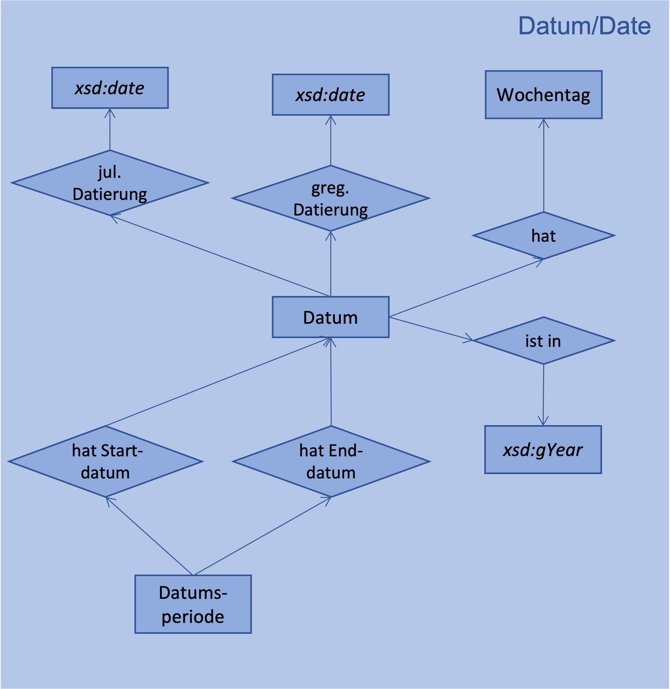

# Ontology date
## Modell

[//]: <> (## Beispiel)
[//]: <> (

)

## Definition der Klassen, Beziehungen und Instanzen

| Predicate | Object |
|:-------- |:-------- |
| [rdf:type](http://www.w3.org/1999/02/22-rdf-syntax-ns#type) | [owl:Ontology](http://www.w3.org/2002/07/owl#Ontology); |
| [dct:license](http://purl.org/dc/terms/license) | <http://creativecommons.org/licenses/by/3.0/>; |
| [dct:title](http://purl.org/dc/terms/title) | "An ontology about date and time"@en; |
| [dct:description](http://purl.org/dc/terms/description) | """Formal description of a gregorian and julian dates, general subclasses, related classes and properties."""@en; |
| [dct:creator](http://purl.org/dc/terms/creator) | "Rebekka Plüss, research assistant and software developer, States Archive canton of Zürich"@en; |
| [dct:publisher](http://purl.org/dc/terms/publisher) | "States Archive canton of Zürich"@en; |
| [owl:versionInfo](http://www.w3.org/2002/07/owl#versionInfo) | "2022-01-12"^^xsd:date. |
# CLASSES
## Date
| Predicate | Object |
|:-------- |:-------- |
| [rdfs:isDefinedBy](http://www.w3.org/2000/01/rdf-schema#isDefinedBy) | <https://github.com/stazh/sw-ehedaten/tree/main/ontology/date#Date>; |
| [rdf:type](http://www.w3.org/1999/02/22-rdf-syntax-ns#type) | [rdfs:Class](http://www.w3.org/2000/01/rdf-schema#Class); |
| [rdfs:label](http://www.w3.org/2000/01/rdf-schema#label) | "Date"@en, "Datum"@de; |
| [rdfs:comment](http://www.w3.org/2000/01/rdf-schema#comment) | """date of a day."""@en; |
| [rdfs:subClassOf](http://www.w3.org/2000/01/rdf-schema#subClassOf) | [archiving:TimePeriod](https://github.com/stazh/sw-ehedaten/tree/main/ontology/archiving#TimePeriod). |
## DatePeriod
| Predicate | Object |
|:-------- |:-------- |
| [rdfs:isDefinedBy](http://www.w3.org/2000/01/rdf-schema#isDefinedBy) | <https://github.com/stazh/sw-ehedaten/tree/main/ontology/date#DatePeriod>; |
| [rdf:type](http://www.w3.org/1999/02/22-rdf-syntax-ns#type) | [rdfs:Class](http://www.w3.org/2000/01/rdf-schema#Class); |
| [rdfs:label](http://www.w3.org/2000/01/rdf-schema#label) | "Date period"@en, "Datumsperiode"@de; |
| [rdfs:comment](http://www.w3.org/2000/01/rdf-schema#comment) | """date period with start date and end date."""@en; |
| [rdfs:subClassOf](http://www.w3.org/2000/01/rdf-schema#subClassOf) | [archiving:TimePeriod](https://github.com/stazh/sw-ehedaten/tree/main/ontology/archiving#TimePeriod). |
## Weekday
| Predicate | Object |
|:-------- |:-------- |
| [rdfs:isDefinedBy](http://www.w3.org/2000/01/rdf-schema#isDefinedBy) | <https://github.com/stazh/sw-ehedaten/tree/main/ontology/date#Weekday>; |
| [rdf:type](http://www.w3.org/1999/02/22-rdf-syntax-ns#type) | [rdfs:Class](http://www.w3.org/2000/01/rdf-schema#Class); |
| [rdfs:label](http://www.w3.org/2000/01/rdf-schema#label) | "Weekday"@en, "Wochentag"@de; |
| [rdfs:comment](http://www.w3.org/2000/01/rdf-schema#comment) | """The class instances are the seven days of the week."""@en; |
| [owl:oneOf](http://www.w3.org/2002/07/owl#oneOf) | [date:Monday date:Tuesday date:Wednesday date:Thursday date:Friday date:Saturday date:Sunday](https://github.com/stazh/sw-ehedaten/tree/main/ontology/date#Monday dat). |
# PROPERTIES
## julianDating
| Predicate | Object |
|:-------- |:-------- |
| [rdfs:isDefinedBy](http://www.w3.org/2000/01/rdf-schema#isDefinedBy) | <https://github.com/stazh/sw-ehedaten/tree/main/ontology/date#julianDating>; |
| [rdf:type](http://www.w3.org/1999/02/22-rdf-syntax-ns#type) | [owl:DatatypeProperty](http://www.w3.org/2002/07/owl#DatatypeProperty); |
| [rdfs:label](http://www.w3.org/2000/01/rdf-schema#label) | "julian dating"@en, "julianische Datierung"@de; |
| [rdfs:comment](http://www.w3.org/2000/01/rdf-schema#comment) | """Relating a date object to its julian date."""@en; |
| [rdfs:domain](http://www.w3.org/2000/01/rdf-schema#domain) | [date:Date](https://github.com/stazh/sw-ehedaten/tree/main/ontology/date#Date); |
| [rdfs:range](http://www.w3.org/2000/01/rdf-schema#range) | [xsd:date](http://www.w3.org/2001/XMLSchema#date). |
## gregorianDating
| Predicate | Object |
|:-------- |:-------- |
| [rdfs:isDefinedBy](http://www.w3.org/2000/01/rdf-schema#isDefinedBy) | <https://github.com/stazh/sw-ehedaten/tree/main/ontology/date#gregorianDating>; |
| [rdf:type](http://www.w3.org/1999/02/22-rdf-syntax-ns#type) | [owl:DatatypeProperty](http://www.w3.org/2002/07/owl#DatatypeProperty); |
| [rdfs:label](http://www.w3.org/2000/01/rdf-schema#label) | "gregorian dating"@en, "gregorianische Datierung"@de; |
| [rdfs:comment](http://www.w3.org/2000/01/rdf-schema#comment) | """Relating a date object to its gregorian date."""@en; |
| [rdfs:domain](http://www.w3.org/2000/01/rdf-schema#domain) | [date:Date](https://github.com/stazh/sw-ehedaten/tree/main/ontology/date#Date); |
| [rdfs:range](http://www.w3.org/2000/01/rdf-schema#range) | [xsd:date](http://www.w3.org/2001/XMLSchema#date). |
## dateIsInYear
| Predicate | Object |
|:-------- |:-------- |
| [rdfs:isDefinedBy](http://www.w3.org/2000/01/rdf-schema#isDefinedBy) | <https://github.com/stazh/sw-ehedaten/tree/main/ontology/date#dateIsInYear>; |
| [rdf:type](http://www.w3.org/1999/02/22-rdf-syntax-ns#type) | [owl:DatatypeProperty](http://www.w3.org/2002/07/owl#DatatypeProperty); |
| [rdfs:label](http://www.w3.org/2000/01/rdf-schema#label) | "date is in year"@en, "Datum ist in Jahr"@de; |
| [rdfs:comment](http://www.w3.org/2000/01/rdf-schema#comment) | """Relating a date object to its year."""@en; |
| [rdfs:domain](http://www.w3.org/2000/01/rdf-schema#domain) | [date:Date](https://github.com/stazh/sw-ehedaten/tree/main/ontology/date#Date); |
| [rdfs:range](http://www.w3.org/2000/01/rdf-schema#range) | [xsd:gYear](http://www.w3.org/2001/XMLSchema#gYear). |
## dateHasWeekday
| Predicate | Object |
|:-------- |:-------- |
| [rdfs:isDefinedBy](http://www.w3.org/2000/01/rdf-schema#isDefinedBy) | <https://github.com/stazh/sw-ehedaten/tree/main/ontology/date#dateHasWeekday>; |
| [rdf:type](http://www.w3.org/1999/02/22-rdf-syntax-ns#type) | [owl:ObjectProperty](http://www.w3.org/2002/07/owl#ObjectProperty); |
| [rdfs:label](http://www.w3.org/2000/01/rdf-schema#label) | "date has weekday."@en, "Datum hat Wochentag"@de; |
| [rdfs:comment](http://www.w3.org/2000/01/rdf-schema#comment) | """Relating a date object the weekday."""@en; |
| [rdfs:domain](http://www.w3.org/2000/01/rdf-schema#domain) | [date:Date](https://github.com/stazh/sw-ehedaten/tree/main/ontology/date#Date); |
| [rdfs:range](http://www.w3.org/2000/01/rdf-schema#range) | [date:Weekday](https://github.com/stazh/sw-ehedaten/tree/main/ontology/date#Weekday). |
## datePeriodHasStartDate
| Predicate | Object |
|:-------- |:-------- |
| [rdfs:isDefinedBy](http://www.w3.org/2000/01/rdf-schema#isDefinedBy) | <https://github.com/stazh/sw-ehedaten/tree/main/ontology/date#datePeriodHasStartDate>; |
| [rdf:type](http://www.w3.org/1999/02/22-rdf-syntax-ns#type) | [owl:ObjectProperty](http://www.w3.org/2002/07/owl#ObjectProperty); |
| [rdfs:label](http://www.w3.org/2000/01/rdf-schema#label) | "date period has start date"@en, "Datumsperiode hat Startdatum"@de; |
| [rdfs:comment](http://www.w3.org/2000/01/rdf-schema#comment) | """Relating a date period object to its start date."""@en; |
| [rdfs:domain](http://www.w3.org/2000/01/rdf-schema#domain) | [date:DatePeriod](https://github.com/stazh/sw-ehedaten/tree/main/ontology/date#DatePeriod); |
| [rdfs:range](http://www.w3.org/2000/01/rdf-schema#range) | [date:Date](https://github.com/stazh/sw-ehedaten/tree/main/ontology/date#Date). |
## datePeriodHasEndDate
| Predicate | Object |
|:-------- |:-------- |
| [rdfs:isDefinedBy](http://www.w3.org/2000/01/rdf-schema#isDefinedBy) | <https://github.com/stazh/sw-ehedaten/tree/main/ontology/date#datePeriodHasEndDate>; |
| [rdf:type](http://www.w3.org/1999/02/22-rdf-syntax-ns#type) | [owl:ObjectProperty](http://www.w3.org/2002/07/owl#ObjectProperty); |
| [rdfs:label](http://www.w3.org/2000/01/rdf-schema#label) | "date period has end date"@en, "Datumsperiode hat Enddatum"@de; |
| [rdfs:comment](http://www.w3.org/2000/01/rdf-schema#comment) | """Relating a date period object to its end date."""@en; |
| [rdfs:domain](http://www.w3.org/2000/01/rdf-schema#domain) | [date:DatePeriod](https://github.com/stazh/sw-ehedaten/tree/main/ontology/date#DatePeriod); |
| [rdfs:range](http://www.w3.org/2000/01/rdf-schema#range) | [date:Date](https://github.com/stazh/sw-ehedaten/tree/main/ontology/date#Date). |
# INSTANCES
## Monday
| Predicate | Object |
|:-------- |:-------- |
| [rdfs:isDefinedBy](http://www.w3.org/2000/01/rdf-schema#isDefinedBy) | <https://github.com/stazh/sw-ehedaten/tree/main/ontology/date#Monday>; |
| [rdf:type](http://www.w3.org/1999/02/22-rdf-syntax-ns#type) | [date:Weekday](https://github.com/stazh/sw-ehedaten/tree/main/ontology/date#Weekday); |
| [rdfs:label](http://www.w3.org/2000/01/rdf-schema#label) | "Monday"@en, "Montag"@de. |
## Tuesday
| Predicate | Object |
|:-------- |:-------- |
| [rdfs:isDefinedBy](http://www.w3.org/2000/01/rdf-schema#isDefinedBy) | <https://github.com/stazh/sw-ehedaten/tree/main/ontology/date#Tuesday>; |
| [rdf:type](http://www.w3.org/1999/02/22-rdf-syntax-ns#type) | [date:Weekday](https://github.com/stazh/sw-ehedaten/tree/main/ontology/date#Weekday); |
| [rdfs:label](http://www.w3.org/2000/01/rdf-schema#label) | "Tuesday"@en, "Dienstag"@de. |
## Wednesday
| Predicate | Object |
|:-------- |:-------- |
| [rdfs:isDefinedBy](http://www.w3.org/2000/01/rdf-schema#isDefinedBy) | <https://github.com/stazh/sw-ehedaten/tree/main/ontology/date#Wednesday>; |
| [rdf:type](http://www.w3.org/1999/02/22-rdf-syntax-ns#type) | [date:Weekday](https://github.com/stazh/sw-ehedaten/tree/main/ontology/date#Weekday); |
| [rdfs:label](http://www.w3.org/2000/01/rdf-schema#label) | "Wednesday"@en, "Mittwoch"@de. |
## Thursday
| Predicate | Object |
|:-------- |:-------- |
| [rdfs:isDefinedBy](http://www.w3.org/2000/01/rdf-schema#isDefinedBy) | <https://github.com/stazh/sw-ehedaten/tree/main/ontology/date#Thursday>; |
| [rdf:type](http://www.w3.org/1999/02/22-rdf-syntax-ns#type) | [date:Weekday](https://github.com/stazh/sw-ehedaten/tree/main/ontology/date#Weekday); |
| [rdfs:label](http://www.w3.org/2000/01/rdf-schema#label) | "Thursday"@en, "Donnerstag"@de. |
## Friday
| Predicate | Object |
|:-------- |:-------- |
| [rdfs:isDefinedBy](http://www.w3.org/2000/01/rdf-schema#isDefinedBy) | <https://github.com/stazh/sw-ehedaten/tree/main/ontology/date#Friday>; |
| [rdf:type](http://www.w3.org/1999/02/22-rdf-syntax-ns#type) | [date:Weekday](https://github.com/stazh/sw-ehedaten/tree/main/ontology/date#Weekday); |
| [rdfs:label](http://www.w3.org/2000/01/rdf-schema#label) | "Friday"@en, "Freitag"@de. |
## Saturday
| Predicate | Object |
|:-------- |:-------- |
| [rdfs:isDefinedBy](http://www.w3.org/2000/01/rdf-schema#isDefinedBy) | <https://github.com/stazh/sw-ehedaten/tree/main/ontology/date#Saturday>; |
| [rdf:type](http://www.w3.org/1999/02/22-rdf-syntax-ns#type) | [date:Weekday](https://github.com/stazh/sw-ehedaten/tree/main/ontology/date#Weekday); |
| [rdfs:label](http://www.w3.org/2000/01/rdf-schema#label) | "Saturday"@en, "Samstag"@de. |
## Sunday
| Predicate | Object |
|:-------- |:-------- |
| [rdfs:isDefinedBy](http://www.w3.org/2000/01/rdf-schema#isDefinedBy) | <https://github.com/stazh/sw-ehedaten/tree/main/ontology/date#Sunday>; |
| [rdf:type](http://www.w3.org/1999/02/22-rdf-syntax-ns#type) | [date:Weekday](https://github.com/stazh/sw-ehedaten/tree/main/ontology/date#Weekday); |
| [rdfs:label](http://www.w3.org/2000/01/rdf-schema#label) | "Sunday"@en, "Sonntag"@de. |
