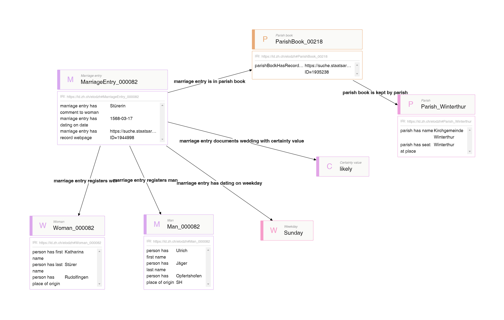

# Ontology elodzh

## Modell

## Beispiel

## [--> Beispielabfragen](https://github.com/stazh/sw-ehedaten/tree/main/queries/elodzh)

## Definition der Klassen und Beziehungen
| Predicate | Object |
|:-------- |:-------- |
| [rdf:type](http://www.w3.org/1999/02/22-rdf-syntax-ns#type) | [owl:Ontology](http://www.w3.org/2002/07/owl#Ontology); |
| [dct:license](http://purl.org/dc/terms/license) | <http://creativecommons.org/licenses/by/3.0/>; |
| [dct:title](http://purl.org/dc/terms/title) | "An ontology about marriage entries from the 16th to 18th century in Zürich"@en; |
| [dct:description](http://purl.org/dc/terms/description) | """Formal description marriage entries, general subclasses, related classes and properties."""@en; |
| [dct:publisher](http://purl.org/dc/terms/publisher) | "States Archive canton of Zürich"@en; |
| [dct:creator](http://purl.org/dc/terms/creator) | "Rebekka Plüss, States Archive canton of Zürich"@en; |
| [owl:versionInfo](http://www.w3.org/2002/07/owl#versionInfo) | "2022-05-23"^^xsd:date. |
# CLASSES
## MarriageEntry
| Predicate | Object |
|:-------- |:-------- |
| [rdf:type](http://www.w3.org/1999/02/22-rdf-syntax-ns#type) | [rdfs:Class](http://www.w3.org/2000/01/rdf-schema#Class); |
| [rdfs:label](http://www.w3.org/2000/01/rdf-schema#label) | "Marriage entry"@en, "Eheeintrag"@de; |
| [rdfs:comment](http://www.w3.org/2000/01/rdf-schema#comment) | """Marriage entry as a note by the parish priest in a parish book stating that two persons were married on a certain day or that the marriage of two persons is proclaimed on a certain day."""@en. |
## ParishBook
| Predicate | Object |
|:-------- |:-------- |
| [rdf:type](http://www.w3.org/1999/02/22-rdf-syntax-ns#type) | [rdfs:Class](http://www.w3.org/2000/01/rdf-schema#Class); |
| [rdfs:label](http://www.w3.org/2000/01/rdf-schema#label) | "Parish book"@en, "Pfarrbuch"@de; |
| [rdfs:comment](http://www.w3.org/2000/01/rdf-schema#comment) | """The book in which a wedding or marriage proclamation is registered resp. the marriage entry is written."""@en. |
## Parish
| Predicate | Object |
|:-------- |:-------- |
| [rdf:type](http://www.w3.org/1999/02/22-rdf-syntax-ns#type) | [rdfs:Class](http://www.w3.org/2000/01/rdf-schema#Class); |
| [rdfs:label](http://www.w3.org/2000/01/rdf-schema#label) | "Parish"@en, "Kirchgemeinde"@de; |
| [rdfs:comment](http://www.w3.org/2000/01/rdf-schema#comment) | """Parish as a religious organization that conducts preaching and usually has an associated church."""@en. |
## Person
| Predicate | Object |
|:-------- |:-------- |
| [rdf:type](http://www.w3.org/1999/02/22-rdf-syntax-ns#type) | [rdfs:Class](http://www.w3.org/2000/01/rdf-schema#Class); |
| [rdfs:label](http://www.w3.org/2000/01/rdf-schema#label) | "Person"@en, "Person"@de; |
| [rdfs:comment](http://www.w3.org/2000/01/rdf-schema#comment) | """A real born human"""@en; |
| [rdfs:subClassOf](http://www.w3.org/2000/01/rdf-schema#subClassOf) | [nie-ine-human:Person](http://e-editiones.ch/ontology/human#Person). |
## Woman
| Predicate | Object |
|:-------- |:-------- |
| [rdf:type](http://www.w3.org/1999/02/22-rdf-syntax-ns#type) | [rdfs:Class](http://www.w3.org/2000/01/rdf-schema#Class); |
| [rdfs:label](http://www.w3.org/2000/01/rdf-schema#label) | "Woman"@en, "Frau"@de; |
| [rdfs:comment](http://www.w3.org/2000/01/rdf-schema#comment) | """A real born human with female sex"""@en; |
| [rdfs:subClassOf](http://www.w3.org/2000/01/rdf-schema#subClassOf) | [elodzh:Person](https://github.com/stazh/sw-ehedaten/tree/main/ontology/elodzh#Person). |
## Man
| Predicate | Object |
|:-------- |:-------- |
| [rdf:type](http://www.w3.org/1999/02/22-rdf-syntax-ns#type) | [rdfs:Class](http://www.w3.org/2000/01/rdf-schema#Class); |
| [rdfs:label](http://www.w3.org/2000/01/rdf-schema#label) | "Man"@en, "Mann"@de; |
| [rdfs:comment](http://www.w3.org/2000/01/rdf-schema#comment) | """A real born human with male sex"""@en; |
| [rdfs:subClassOf](http://www.w3.org/2000/01/rdf-schema#subClassOf) | [elodzh:Person](https://github.com/stazh/sw-ehedaten/tree/main/ontology/elodzh#Person). |
## Weekday
| Predicate | Object |
|:-------- |:-------- |
| [rdfs:isDefinedBy](http://www.w3.org/2000/01/rdf-schema#isDefinedBy) | <https://github.com/stazh/sw-ehedaten/tree/main/ontology/date#Weekday>; |
| [rdf:type](http://www.w3.org/1999/02/22-rdf-syntax-ns#type) | [rdfs:Class](http://www.w3.org/2000/01/rdf-schema#Class); |
| [rdfs:label](http://www.w3.org/2000/01/rdf-schema#label) | "Weekday"@en, "Wochentag"@de; |
| [rdfs:comment](http://www.w3.org/2000/01/rdf-schema#comment) | """The class instances are the seven days of the week."""@en; |
| [owl:oneOf](http://www.w3.org/2002/07/owl#oneOf) | [elodzh:Monday elodzh:Tuesday elodzh:Wednesday elodzh:Thursday elodzh:Friday elodzh:Saturday elodzh:Sunday](https://github.com/stazh/sw-ehedaten/tree/main/ontology/elodzh#Monday elodz). |
## CertaintyValue
| Predicate | Object |
|:-------- |:-------- |
| [rdf:type](http://www.w3.org/1999/02/22-rdf-syntax-ns#type) | [rdfs:Class](http://www.w3.org/2000/01/rdf-schema#Class); |
| [rdfs:label](http://www.w3.org/2000/01/rdf-schema#label) | "Certainty value"@en, "Sicherheitswert"@de; |
| [rdfs:comment](http://www.w3.org/2000/01/rdf-schema#comment) | """Value of a certainty in a proposition by a certain agent in a certain time."""@en; |
| [rdfs:subClassOf](http://www.w3.org/2000/01/rdf-schema#subClassOf) | [cidoc-inf:I2_Belief](http://www.ics.forth.gr/isl/CRMinf/I2_Belief).|

# INSTANCES
## Likely
| Predicate | Object |
|:-------- |:-------- |
| [rdf:type](http://www.w3.org/1999/02/22-rdf-syntax-ns#type) | [elodzh:CertaintyValue](https://github.com/stazh/sw-ehedaten/tree/main/ontology/elodzh#CertaintyValue); |
| [rdfs:label](http://www.w3.org/2000/01/rdf-schema#label) | "likely"@en, "warscheinlich"@de; |
| [rdfs:comment](http://www.w3.org/2000/01/rdf-schema#comment) | """Certainty value representing a moderate probability of being true."""@en. |
## VeryLikely
| Predicate | Object |
|:-------- |:-------- |
| [rdf:type](http://www.w3.org/1999/02/22-rdf-syntax-ns#type) | [elodzh:CertaintyValue](https://github.com/stazh/sw-ehedaten/tree/main/ontology/elodzh#CertaintyValue); |
| [rdfs:label](http://www.w3.org/2000/01/rdf-schema#label) | "very likely"@en, "sehr warscheinlich"@de; |
| [rdfs:comment](http://www.w3.org/2000/01/rdf-schema#comment) | """Certainty value representing a high probability of being true."""@en. |
## Monday
| Predicate | Object |
|:-------- |:-------- |
| [rdfs:isDefinedBy](http://www.w3.org/2000/01/rdf-schema#isDefinedBy) | <https://github.com/stazh/sw-ehedaten/tree/main/ontology/date#Monday>; |
| [rdf:type](http://www.w3.org/1999/02/22-rdf-syntax-ns#type) | [elodzh:Weekday](https://github.com/stazh/sw-ehedaten/tree/main/ontology/elodzh#Weekday); |
| [rdfs:label](http://www.w3.org/2000/01/rdf-schema#label) | "Monday"@en, "Montag"@de. |
## Tuesday
| Predicate | Object |
|:-------- |:-------- |
| [rdfs:isDefinedBy](http://www.w3.org/2000/01/rdf-schema#isDefinedBy) | <https://github.com/stazh/sw-ehedaten/tree/main/ontology/date#Tuesday>; |
| [rdf:type](http://www.w3.org/1999/02/22-rdf-syntax-ns#type) | [elodzh:Weekday](https://github.com/stazh/sw-ehedaten/tree/main/ontology/elodzh#Weekday); |
| [rdfs:label](http://www.w3.org/2000/01/rdf-schema#label) | "Tuesday"@en, "Dienstag"@de. |
## Wednesday
| Predicate | Object |
|:-------- |:-------- |
| [rdfs:isDefinedBy](http://www.w3.org/2000/01/rdf-schema#isDefinedBy) | <https://github.com/stazh/sw-ehedaten/tree/main/ontology/date#Wednesday>; |
| [rdf:type](http://www.w3.org/1999/02/22-rdf-syntax-ns#type) | [elodzh:Weekday](https://github.com/stazh/sw-ehedaten/tree/main/ontology/elodzh#Weekday); |
| [rdfs:label](http://www.w3.org/2000/01/rdf-schema#label) | "Wednesday"@en, "Mittwoch"@de. |
## Thursday
| Predicate | Object |
|:-------- |:-------- |
| [rdfs:isDefinedBy](http://www.w3.org/2000/01/rdf-schema#isDefinedBy) | <https://github.com/stazh/sw-ehedaten/tree/main/ontology/date#Thursday>; |
| [rdf:type](http://www.w3.org/1999/02/22-rdf-syntax-ns#type) | [elodzh:Weekday](https://github.com/stazh/sw-ehedaten/tree/main/ontology/elodzh#Weekday); |
| [rdfs:label](http://www.w3.org/2000/01/rdf-schema#label) | "Thursday"@en, "Donnerstag"@de. |
## Friday
| Predicate | Object |
|:-------- |:-------- |
| [rdfs:isDefinedBy](http://www.w3.org/2000/01/rdf-schema#isDefinedBy) | <https://github.com/stazh/sw-ehedaten/tree/main/ontology/date#Friday>; |
| [rdf:type](http://www.w3.org/1999/02/22-rdf-syntax-ns#type) | [elodzh:Weekday](https://github.com/stazh/sw-ehedaten/tree/main/ontology/elodzh#Weekday); |
| [rdfs:label](http://www.w3.org/2000/01/rdf-schema#label) | "Friday"@en, "Freitag"@de. |
## Saturday
| Predicate | Object |
|:-------- |:-------- |
| [rdfs:isDefinedBy](http://www.w3.org/2000/01/rdf-schema#isDefinedBy) | <https://github.com/stazh/sw-ehedaten/tree/main/ontology/date#Saturday>; |
| [rdf:type](http://www.w3.org/1999/02/22-rdf-syntax-ns#type) | [elodzh:Weekday](https://github.com/stazh/sw-ehedaten/tree/main/ontology/elodzh#Weekday); |
| [rdfs:label](http://www.w3.org/2000/01/rdf-schema#label) | "Saturday"@en, "Samstag"@de. |
## Sunday
| Predicate | Object |
|:-------- |:-------- |
| [rdfs:isDefinedBy](http://www.w3.org/2000/01/rdf-schema#isDefinedBy) | <https://github.com/stazh/sw-ehedaten/tree/main/ontology/date#Sunday>; |
| [rdf:type](http://www.w3.org/1999/02/22-rdf-syntax-ns#type) | [elodzh:Weekday](https://github.com/stazh/sw-ehedaten/tree/main/ontology/elodzh#Weekday); |
| [rdfs:label](http://www.w3.org/2000/01/rdf-schema#label) | "Sunday"@en, "Sonntag"@de. |
# PROPERTIES
## marriageEntryIsInParishBook
| Predicate | Object |
|:-------- |:-------- |
| [rdf:type](http://www.w3.org/1999/02/22-rdf-syntax-ns#type) | [owl:ObjectProperty](http://www.w3.org/2002/07/owl#ObjectProperty); |
| [rdfs:label](http://www.w3.org/2000/01/rdf-schema#label) | "marriage entry is in parish book"@en, "Eheeintrag befindet sich in Pfarrbuch"@de; |
| [rdfs:comment](http://www.w3.org/2000/01/rdf-schema#comment) | """Relating a marriage entry to its parish book in which it is written."""@en; |
| [rdfs:domain](http://www.w3.org/2000/01/rdf-schema#domain) | [elodzh:MarriageEntry](https://github.com/stazh/sw-ehedaten/tree/main/ontology/elodzh#MarriageEntry); |
| [rdfs:range](http://www.w3.org/2000/01/rdf-schema#range) | [elodzh:ParishBook](https://github.com/stazh/sw-ehedaten/tree/main/ontology/elodzh#ParishBook). |
## marriageEntryHasCommentToWoman
| Predicate | Object |
|:-------- |:-------- |
| [rdf:type](http://www.w3.org/1999/02/22-rdf-syntax-ns#type) | [owl:DatatypeProperty](http://www.w3.org/2002/07/owl#DatatypeProperty); |
| [rdfs:label](http://www.w3.org/2000/01/rdf-schema#label) | "marriage entry has comment to woman"@en, "Eheeintrag hat Anmerkung zu Frau"@de; |
| [rdfs:comment](http://www.w3.org/2000/01/rdf-schema#comment) | """Relating a marriage entry to the comment written as a note next to the woman registered in the entry."""@en; |
| [rdfs:domain](http://www.w3.org/2000/01/rdf-schema#domain) | [elodzh:MarriageEntry](https://github.com/stazh/sw-ehedaten/tree/main/ontology/elodzh#MarriageEntry); |
| [rdfs:range](http://www.w3.org/2000/01/rdf-schema#range) | [rdfs:Literal](http://www.w3.org/2000/01/rdf-schema#Literal). |
## marriageEntryHasGeneralCommentOrCommentToMan
| Predicate | Object |
|:-------- |:-------- |
| [rdf:type](http://www.w3.org/1999/02/22-rdf-syntax-ns#type) | [owl:DatatypeProperty](http://www.w3.org/2002/07/owl#DatatypeProperty); |
| [rdfs:label](http://www.w3.org/2000/01/rdf-schema#label) | "marriage entry has general comment or comment to man"@en, "Eheeintrag hat allgemeine Anmerkung oder Anmerkung zu Mann"@de; |
| [rdfs:comment](http://www.w3.org/2000/01/rdf-schema#comment) | """Relating a marriage entry to the comment written as a note next to the man registered in the entry. It mustn't be a comment to the man, it can also be a general comment to the marriage."""@en; |
| [rdfs:domain](http://www.w3.org/2000/01/rdf-schema#domain) | [elodzh:MarriageEntry](https://github.com/stazh/sw-ehedaten/tree/main/ontology/elodzh#MarriageEntry); |
| [rdfs:range](http://www.w3.org/2000/01/rdf-schema#range) | [rdfs:Literal](http://www.w3.org/2000/01/rdf-schema#Literal). |
## parishBookIsKeptByParish
| Predicate | Object |
|:-------- |:-------- |
| [rdf:type](http://www.w3.org/1999/02/22-rdf-syntax-ns#type) | [owl:ObjectProperty](http://www.w3.org/2002/07/owl#ObjectProperty); |
| [rdfs:label](http://www.w3.org/2000/01/rdf-schema#label) | "parish book is kept by parish"@en, "Pfarrbuch wird geführt von Kirchgemeinde"@de; |
| [rdfs:comment](http://www.w3.org/2000/01/rdf-schema#comment) | """Relating a parish book to the parish in which it is kept."""@en; |
| [rdfs:domain](http://www.w3.org/2000/01/rdf-schema#domain) | [elodzh:ParishBook](https://github.com/stazh/sw-ehedaten/tree/main/ontology/elodzh#ParishBook); |
| [rdfs:range](http://www.w3.org/2000/01/rdf-schema#range) | [elodzh:Parish](https://github.com/stazh/sw-ehedaten/tree/main/ontology/elodzh#Parish). |
## marriageEntryRegistersWoman
| Predicate | Object |
|:-------- |:-------- |
| [rdf:type](http://www.w3.org/1999/02/22-rdf-syntax-ns#type) | [owl:ObjectProperty](http://www.w3.org/2002/07/owl#ObjectProperty); |
| [rdfs:label](http://www.w3.org/2000/01/rdf-schema#label) | "marriage entry registers woman"@en, "Eheeintrag registriert Frau"@de; |
| [rdfs:comment](http://www.w3.org/2000/01/rdf-schema#comment) | """Relating a marriage entry to the woman it registers."""@en; |
| [rdfs:domain](http://www.w3.org/2000/01/rdf-schema#domain) | [elodzh:MarriageEntry](https://github.com/stazh/sw-ehedaten/tree/main/ontology/elodzh#MarriageEntry); |
| [rdfs:range](http://www.w3.org/2000/01/rdf-schema#range) | [elodzh:Woman](https://github.com/stazh/sw-ehedaten/tree/main/ontology/elodzh#Woman). |
## marriageEntryRegistersMan
| Predicate | Object |
|:-------- |:-------- |
| [rdf:type](http://www.w3.org/1999/02/22-rdf-syntax-ns#type) | [owl:ObjectProperty](http://www.w3.org/2002/07/owl#ObjectProperty); |
| [rdfs:label](http://www.w3.org/2000/01/rdf-schema#label) | "marriage entry registers man"@en, "Eheeintrag registriert Mann"@de; |
| [rdfs:comment](http://www.w3.org/2000/01/rdf-schema#comment) | """Relating a marriage entry to the man it registers."""@en; |
| [rdfs:domain](http://www.w3.org/2000/01/rdf-schema#domain) | [elodzh:MarriageEntry](https://github.com/stazh/sw-ehedaten/tree/main/ontology/elodzh#MarriageEntry); |
| [rdfs:range](http://www.w3.org/2000/01/rdf-schema#range) | [elodzh:Man](https://github.com/stazh/sw-ehedaten/tree/main/ontology/elodzh#Man). |
## marriageEntryHasDatingOnDate
| Predicate | Object |
|:-------- |:-------- |
| [rdf:type](http://www.w3.org/1999/02/22-rdf-syntax-ns#type) | [owl:DatatypeProperty](http://www.w3.org/2002/07/owl#DatatypeProperty); |
| [rdfs:label](http://www.w3.org/2000/01/rdf-schema#label) | "marriage entry has dating on date"@en, "Eheeintrag hat Datierung auf Datum"@de; |
| [rdfs:comment](http://www.w3.org/2000/01/rdf-schema#comment) | """Relating a marriage entry to its registered gregorian date (julian datings were converted into gregorian dating)."""@en; |
| [rdfs:domain](http://www.w3.org/2000/01/rdf-schema#domain) | [elodzh:MarriageEntry](https://github.com/stazh/sw-ehedaten/tree/main/ontology/elodzh#MarriageEntry); |
| [rdfs:range](http://www.w3.org/2000/01/rdf-schema#range) | [xsd:date](http://www.w3.org/2001/XMLSchema#date). |

## marriageEntryHasDatingOnWeekday
| Predicate | Object |
|:-------- |:-------- |
| [rdf:type](http://www.w3.org/1999/02/22-rdf-syntax-ns#type) | [owl:ObjectProperty](http://www.w3.org/2002/07/owl#ObjectProperty); |
| [rdfs:label](http://www.w3.org/2000/01/rdf-schema#label) | "marriage entry has dating on weekday"@en, "Eheeintrag hat Datierung an Wochentag"@de; |
| [rdfs:comment](http://www.w3.org/2000/01/rdf-schema#comment) | """Relating a marriage entry to its weekday."""@en; |
| [rdfs:domain](http://www.w3.org/2000/01/rdf-schema#domain) | [elodzh:MarriageEntry](https://github.com/stazh/sw-ehedaten/tree/main/ontology/elodzh#MarriageEntry); |
| [rdfs:range](http://www.w3.org/2000/01/rdf-schema#range) | [elodzh:Weekday](https://github.com/stazh/sw-ehedaten/tree/main/ontology/elodzh#Weekday). |

## marriageEntryHasDatePeriodStartDate
| Predicate | Object |
|:-------- |:-------- |
| [rdf:type](http://www.w3.org/1999/02/22-rdf-syntax-ns#type) | [owl:DatatypeProperty](http://www.w3.org/2002/07/owl#DatatypeProperty); |
| [rdfs:label](http://www.w3.org/2000/01/rdf-schema#label) | "marriage entry has date period start date"@en, "Eheeintrag hat Datumsperiode-Startdatum"@de; |
| [rdfs:comment](http://www.w3.org/2000/01/rdf-schema#comment) | """Relating a marriage entry to the date period startdate (startdate of the period within its dating is possible)."""@en; |
| [rdfs:domain](http://www.w3.org/2000/01/rdf-schema#domain) | [elodzh:MarriageEntry](https://github.com/stazh/sw-ehedaten/tree/main/ontology/elodzh#MarriageEntry); |
| [rdfs:range](http://www.w3.org/2000/01/rdf-schema#range) | [xsd:date](http://www.w3.org/2001/XMLSchema#date). |
## marriageEntryHasDatePeriodEndDate
| Predicate | Object |
|:-------- |:-------- |
| [rdf:type](http://www.w3.org/1999/02/22-rdf-syntax-ns#type) | [owl:DatatypeProperty](http://www.w3.org/2002/07/owl#DatatypeProperty); |
| [rdfs:label](http://www.w3.org/2000/01/rdf-schema#label) | "marriage entry has date period end date"@en, "Eheeintrag hat Datumsperiode-Enddatum"@de; |
| [rdfs:comment](http://www.w3.org/2000/01/rdf-schema#comment) | """Relating a marriage entry to the date period enddate (enddate of the period within its dating is possible)."""@en; |
| [rdfs:domain](http://www.w3.org/2000/01/rdf-schema#domain) | [elodzh:MarriageEntry](https://github.com/stazh/sw-ehedaten/tree/main/ontology/elodzh#MarriageEntry); |
| [rdfs:range](http://www.w3.org/2000/01/rdf-schema#range) | [xsd:date](http://www.w3.org/2001/XMLSchema#date). |
## marriageEntryDocumentsMarriageProclamationWithCertaintyValue
| Predicate | Object |
|:-------- |:-------- |
| [rdf:type](http://www.w3.org/1999/02/22-rdf-syntax-ns#type) | [owl:ObjectProperty](http://www.w3.org/2002/07/owl#ObjectProperty); |
| [rdfs:label](http://www.w3.org/2000/01/rdf-schema#label) | "marriage entry documents marriage proclamation with certainty value"@en, "Eheeintrag dokumentiert Eheverkündung mit Sicherheitswert"@de; |
| [rdfs:comment](http://www.w3.org/2000/01/rdf-schema#comment) | """Relating a marriage entry to the certainty value with which it is possible, that the marriage entry documents a marriage proclamation."""@en, """Ein Eheeintrag betrifft entweder eine Verkündung (Proclamation) oder eine Trauung (Wedding): a) Fällt die Datierung eines Eheeintrags auf den Sonntag, so betrifft dieser ab 1620 (Verbot von Sonntagsheiraten) sehr wahrscheinlich eine Verkündung. b) Vermerkte der Editor '[Verkünddatum]' in den Zusatzinformationen eines Eheeintrags oder steht 'promulgiert' oder 'proklamiert' so betrifft dieser sehr wahrscheinlich eine Verkündung. c) Steht in den Zusatzinformationen eines Eheeintrags 'getraut zu ', so betrifft dieser sehr wahrscheinlich eine Verkündung. Trifft a, b und c nicht zu, so betrifft der Eheeintrag wahrscheinlich die Trauung (Wedding)."""@de; |
| [rdfs:domain](http://www.w3.org/2000/01/rdf-schema#domain) | [elodzh:MarriageEntry](https://github.com/stazh/sw-ehedaten/tree/main/ontology/elodzh#MarriageEntry); |
| [rdfs:range](http://www.w3.org/2000/01/rdf-schema#range) | [elodzh:CertaintyValue](https://github.com/stazh/sw-ehedaten/tree/main/ontology/elodzh#CertaintyValue). |
## marriageEntryDocumentsWeddingWithCertaintyValue
| Predicate | Object |
|:-------- |:-------- |
| [rdf:type](http://www.w3.org/1999/02/22-rdf-syntax-ns#type) | [owl:ObjectProperty](http://www.w3.org/2002/07/owl#ObjectProperty); |
| [rdfs:label](http://www.w3.org/2000/01/rdf-schema#label) | "marriage entry documents wedding with certainty value"@en, "Eheeintrag dokumentiert Heirat mit Sicherheitswert"@de; |
| [rdfs:comment](http://www.w3.org/2000/01/rdf-schema#comment) | """Relating a marriage entry to the certainty value with which it is possible, that the marriage entry documents a wedding."""@en, """Ein Eheeintrag betrifft entweder eine Verkündung (Proclamation) oder eine Trauung (Wedding): a) Fällt die Datierung eines Eheeintrags auf den Sonntag, so betrifft dieser ab 1620 (Verbot von Sonntagsheiraten) sehr wahrscheinlich eine Verkündung. b) Vermerkte der Editor '[Verkünddatum]' in den Zusatzinformationen eines Eheeintrags oder steht 'promulgiert' oder 'proklamiert' so betrifft dieser sehr wahrscheinlich eine Verkündung. c) Steht in den Zusatzinformationen eines Eheeintrags 'getraut zu ', so betrifft dieser sehr wahrscheinlich eine Verkündung. Trifft a, b und c nicht zu, so betrifft der Eheeintrag wahrscheinlich die Trauung (Wedding)."""@de; |
| [rdfs:domain](http://www.w3.org/2000/01/rdf-schema#domain) | [elodzh:MarriageEntry](https://github.com/stazh/sw-ehedaten/tree/main/ontology/elodzh#MarriageEntry); |
| [rdfs:range](http://www.w3.org/2000/01/rdf-schema#range) | [elodzh:CertaintyValue](https://github.com/stazh/sw-ehedaten/tree/main/ontology/elodzh#CertaintyValue). |
## parishHasName 
| Predicate | Object |
|:-------- |:-------- |
| [rdf:type](http://www.w3.org/1999/02/22-rdf-syntax-ns#type) | [owl:DatatypeProperty](http://www.w3.org/2002/07/owl#DatatypeProperty); |
| [rdfs:label](http://www.w3.org/2000/01/rdf-schema#label) | "parish has name"@en, "Kirchgemeinde hat Namen"@de; |
| [rdfs:comment](http://www.w3.org/2000/01/rdf-schema#comment) | """Relating a parish to the literal of its name."""@en; |
| [rdfs:domain](http://www.w3.org/2000/01/rdf-schema#domain) | [elodzh:Parish](https://github.com/stazh/sw-ehedaten/tree/main/ontology/elodzh#Parish); |
| [rdfs:range](http://www.w3.org/2000/01/rdf-schema#range) | [rdfs:Literal](http://www.w3.org/2000/01/rdf-schema#Literal). |
## parishHasSeatAtPlace 
| Predicate | Object |
|:-------- |:-------- |
| [rdf:type](http://www.w3.org/1999/02/22-rdf-syntax-ns#type) | [owl:DatatypeProperty](http://www.w3.org/2002/07/owl#DatatypeProperty); |
| [rdfs:label](http://www.w3.org/2000/01/rdf-schema#label) | "parish has seat at place"@en, "Kirchgemeinde hat Sitz an Ort"@de; |
| [rdfs:comment](http://www.w3.org/2000/01/rdf-schema#comment) | """Relating a parish to the literal of the place where it has its seat at."""@en; |
| [rdfs:domain](http://www.w3.org/2000/01/rdf-schema#domain) | [elodzh:Parish](https://github.com/stazh/sw-ehedaten/tree/main/ontology/elodzh#Parish); |
| [rdfs:range](http://www.w3.org/2000/01/rdf-schema#range) | [rdfs:Literal](http://www.w3.org/2000/01/rdf-schema#Literal). |
## personHasFirstName
| Predicate | Object |
|:-------- |:-------- |
| [rdf:type](http://www.w3.org/1999/02/22-rdf-syntax-ns#type) | [owl:DatatypeProperty](http://www.w3.org/2002/07/owl#DatatypeProperty); |
| [rdfs:label](http://www.w3.org/2000/01/rdf-schema#label) | "person has first name"@en, "Person hat Vornamen"@de; |
| [rdfs:comment](http://www.w3.org/2000/01/rdf-schema#comment) | """Relating a person to the literal of its first name"""@en; |
| [rdfs:domain](http://www.w3.org/2000/01/rdf-schema#domain) | [elodzh:Person](https://github.com/stazh/sw-ehedaten/tree/main/ontology/elodzh#Person); |
| [rdfs:range](http://www.w3.org/2000/01/rdf-schema#range) | [rdfs:Literal](http://www.w3.org/2000/01/rdf-schema#Literal). |
## personHasLastName
| Predicate | Object |
|:-------- |:-------- |
| [rdf:type](http://www.w3.org/1999/02/22-rdf-syntax-ns#type) | [owl:DatatypeProperty](http://www.w3.org/2002/07/owl#DatatypeProperty); |
| [rdfs:label](http://www.w3.org/2000/01/rdf-schema#label) | "person has last name"@en, "Person hat Nachnamen"@de; |
| [rdfs:comment](http://www.w3.org/2000/01/rdf-schema#comment) | """Relating a person to the literal of its last name"""@en; |
| [rdfs:domain](http://www.w3.org/2000/01/rdf-schema#domain) | [elodzh:Person](https://github.com/stazh/sw-ehedaten/tree/main/ontology/elodzh#Person); |
| [rdfs:range](http://www.w3.org/2000/01/rdf-schema#range) | [rdfs:Literal](http://www.w3.org/2000/01/rdf-schema#Literal). |
## personHasPlaceOfOrigin
| Predicate | Object |
|:-------- |:-------- |
| [rdf:type](http://www.w3.org/1999/02/22-rdf-syntax-ns#type) | [owl:DatatypeProperty](http://www.w3.org/2002/07/owl#DatatypeProperty); |
| [rdfs:label](http://www.w3.org/2000/01/rdf-schema#label) | "person has place of origin"@en, "Person hat Herkunftsort"@de; |
| [rdfs:comment](http://www.w3.org/2000/01/rdf-schema#comment) | """Relating a person to the literal of its place of origin"""@en; |
| [rdfs:domain](http://www.w3.org/2000/01/rdf-schema#domain) | [elodzh:Person](https://github.com/stazh/sw-ehedaten/tree/main/ontology/elodzh#Person); |
| [rdfs:range](http://www.w3.org/2000/01/rdf-schema#range) | [rdfs:Literal](http://www.w3.org/2000/01/rdf-schema#Literal). |
## personHasEncyclopediaArticle
| Predicate | Object |
|:-------- |:-------- |
| [rdf:type](http://www.w3.org/1999/02/22-rdf-syntax-ns#type) | [owl:DatatypeProperty](http://www.w3.org/2002/07/owl#DatatypeProperty); |
| [rdfs:label](http://www.w3.org/2000/01/rdf-schema#label) | "person has encyclopedia article"@en, "Person hat Lexikonartikel"@de; |
| [rdfs:comment](http://www.w3.org/2000/01/rdf-schema#comment) | """Relating a person to its encyclopedia article URL."""@en; |
| [rdfs:domain](http://www.w3.org/2000/01/rdf-schema#domain) | [elodzh:Person](https://github.com/stazh/sw-ehedaten/tree/main/ontology/elodzh#Person); |
| [rdfs:range](http://www.w3.org/2000/01/rdf-schema#range) | [xsd:anyURI](http://www.w3.org/2001/XMLSchema#anyURI). |
## marriageEntryHasRecordWebpage
| Predicate | Object |
|:-------- |:-------- |
| [rdf:type](http://www.w3.org/1999/02/22-rdf-syntax-ns#type) | [owl:DatatypeProperty](http://www.w3.org/2002/07/owl#DatatypeProperty); |
| [rdfs:label](http://www.w3.org/2000/01/rdf-schema#label) | "marriage entry has record webpage"@en, "Eheeintrag hat Archivkatalogeintrag"; |
| [rdfs:comment](http://www.w3.org/2000/01/rdf-schema#comment) | """Relating a marriage entry to the record webpage uri of the entry in an archive information system."""@en; |
| [rdfs:domain](http://www.w3.org/2000/01/rdf-schema#domain) | [elodzh:MarriageEntry](https://github.com/stazh/sw-ehedaten/tree/main/ontology/elodzh#MarriageEntry); |
| [rdfs:range](http://www.w3.org/2000/01/rdf-schema#range) | [xsd:anyURI](http://www.w3.org/2001/XMLSchema#anyURI). |
## parishBookHasRecordWebpage
| Predicate | Object |
|:-------- |:-------- |
| [rdf:type](http://www.w3.org/1999/02/22-rdf-syntax-ns#type) | [owl:DatatypeProperty](http://www.w3.org/2002/07/owl#DatatypeProperty); |
| [rdfs:label](http://www.w3.org/2000/01/rdf-schema#label) | "parish book has record webpage"@en, "Pfarrbuch hat Archivkatalogeintrag"; |
| [rdfs:comment](http://www.w3.org/2000/01/rdf-schema#comment) | """Relating a parish book to the record webpage url of the entry in an archive information system."""@en; |
| [rdfs:domain](http://www.w3.org/2000/01/rdf-schema#domain) | [elodzh:ParishBook](https://github.com/stazh/sw-ehedaten/tree/main/ontology/elodzh#ParishBook); |
| [rdfs:range](http://www.w3.org/2000/01/rdf-schema#range) | [xsd:anyURI](http://www.w3.org/2001/XMLSchema#anyURI). |
