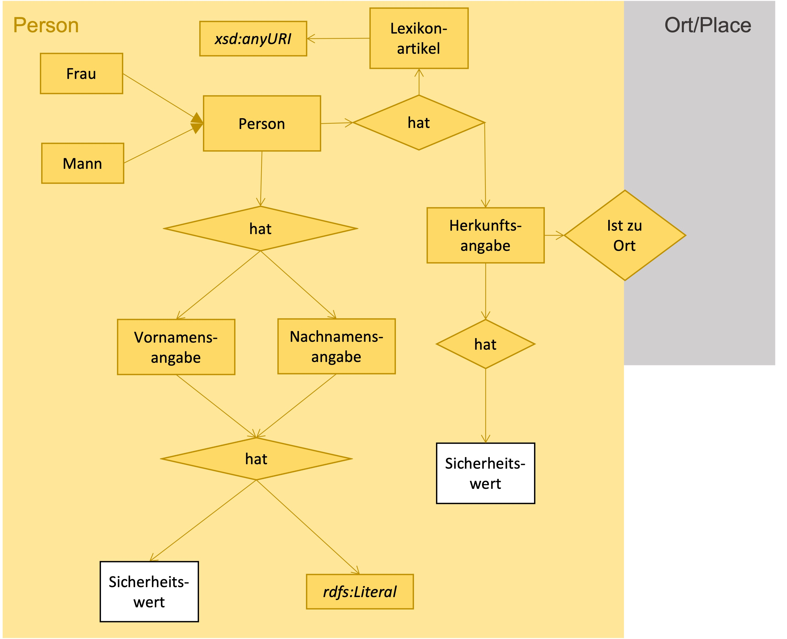

# Ontology person
## Modell

[//]: <> (## Beispiel)
[//]: <> (

)
## Definition der Klassen und Beziehungen

| Predicate | Object |
|:-------- |:-------- |
| [rdf:type](http://www.w3.org/1999/02/22-rdf-syntax-ns#type) | [owl:Ontology](http://www.w3.org/2002/07/owl#Ontology); |
| [dct:license](http://purl.org/dc/terms/license) | <http://creativecommons.org/licenses/by/3.0/>; |
| [dct:title](http://purl.org/dc/terms/title) | "An ontology about person"@en; |
| [dct:description](http://purl.org/dc/terms/description) | """Formal description of a person, general subclasses, related classes and properties."""@en; |
| [dct:creator](http://purl.org/dc/terms/creator) | "Rebekka Plüss, research assistant and software developer, States Archive canton of Zürich"@en; |
| [dct:publisher](http://purl.org/dc/terms/publisher) | "States Archive canton of Zürich"@en; |
| [owl:versionInfo](http://www.w3.org/2002/07/owl#versionInfo) | "2021-11-26"^^xsd:date. |
# CLASSES
## Person
| Predicate | Object |
|:-------- |:-------- |
| [rdfs:isDefinedBy](http://www.w3.org/2000/01/rdf-schema#isDefinedBy) | <https://github.com/stazh/sw-ehedaten/tree/main/ontology/person#Person>; |
| [rdf:type](http://www.w3.org/1999/02/22-rdf-syntax-ns#type) | [rdfs:Class](http://www.w3.org/2000/01/rdf-schema#Class); |
| [rdfs:label](http://www.w3.org/2000/01/rdf-schema#label) | "Person"@en, "Person"@de; |
| [rdfs:comment](http://www.w3.org/2000/01/rdf-schema#comment) | """A real born human"""@en; |
| [rdfs:subClassOf](http://www.w3.org/2000/01/rdf-schema#subClassOf) | [nie-ine-human:Person](http://e-editiones.ch/ontology/human#Person). |
## Woman
| Predicate | Object |
|:-------- |:-------- |
| [rdfs:isDefinedBy](http://www.w3.org/2000/01/rdf-schema#isDefinedBy) | <https://github.com/stazh/sw-ehedaten/tree/main/ontology/person#Woman>; |
| [rdf:type](http://www.w3.org/1999/02/22-rdf-syntax-ns#type) | [rdfs:Class](http://www.w3.org/2000/01/rdf-schema#Class); |
| [rdfs:label](http://www.w3.org/2000/01/rdf-schema#label) | "Woman"@en, "Frau"@de; |
| [rdfs:comment](http://www.w3.org/2000/01/rdf-schema#comment) | """A real born human with female sex"""@en; |
| [rdfs:subClassOf](http://www.w3.org/2000/01/rdf-schema#subClassOf) | [person:Person](https://github.com/stazh/sw-ehedaten/tree/main/ontology/person#Person). |
## Man
| Predicate | Object |
|:-------- |:-------- |
| [rdfs:isDefinedBy](http://www.w3.org/2000/01/rdf-schema#isDefinedBy) | <https://github.com/stazh/sw-ehedaten/tree/main/ontology/person#Man>; |
| [rdf:type](http://www.w3.org/1999/02/22-rdf-syntax-ns#type) | [rdfs:Class](http://www.w3.org/2000/01/rdf-schema#Class); |
| [rdfs:label](http://www.w3.org/2000/01/rdf-schema#label) | "Man"@en, "Mann"@de; |
| [rdfs:comment](http://www.w3.org/2000/01/rdf-schema#comment) | """A real born human with male sex"""@en; |
| [rdfs:subClassOf](http://www.w3.org/2000/01/rdf-schema#subClassOf) | [person:Person](https://github.com/stazh/sw-ehedaten/tree/main/ontology/person#Person). |
## FirstNameSpezification
| Predicate | Object |
|:-------- |:-------- |
| [rdfs:isDefinedBy](http://www.w3.org/2000/01/rdf-schema#isDefinedBy) | <https://github.com/stazh/sw-ehedaten/tree/main/ontology/person#FirstNameSpezification>; |
| [rdf:type](http://www.w3.org/1999/02/22-rdf-syntax-ns#type) | [rdfs:Class](http://www.w3.org/2000/01/rdf-schema#Class); |
| [rdfs:label](http://www.w3.org/2000/01/rdf-schema#label) | "First name spezification"@en, "Vornamensangabe"@de; |
| [rdfs:comment](http://www.w3.org/2000/01/rdf-schema#comment) | """The spezification someone made about a persons first name."""@en. |
## LastNameSpezification
| Predicate | Object |
|:-------- |:-------- |
| [rdfs:isDefinedBy](http://www.w3.org/2000/01/rdf-schema#isDefinedBy) | <https://github.com/stazh/sw-ehedaten/tree/main/ontology/person#LastNameSpezification>; |
| [rdf:type](http://www.w3.org/1999/02/22-rdf-syntax-ns#type) | [rdfs:Class](http://www.w3.org/2000/01/rdf-schema#Class); |
| [rdfs:label](http://www.w3.org/2000/01/rdf-schema#label) | "Last name spezification"@en, "Nachnamensangabe"@de; |
| [rdfs:comment](http://www.w3.org/2000/01/rdf-schema#comment) | """The spezification someone made about a persons last name."""@en. |
## PlaceOfOriginSpezification
| Predicate | Object |
|:-------- |:-------- |
| [rdfs:isDefinedBy](http://www.w3.org/2000/01/rdf-schema#isDefinedBy) | <https://github.com/stazh/sw-ehedaten/tree/main/ontology/person#PlaceOfOriginSpezification>; |
| [rdf:type](http://www.w3.org/1999/02/22-rdf-syntax-ns#type) | [rdfs:Class](http://www.w3.org/2000/01/rdf-schema#Class); |
| [rdfs:label](http://www.w3.org/2000/01/rdf-schema#label) | "Place of origin spezification"@en, "Herkunftssangabe"@de; |
| [rdfs:comment](http://www.w3.org/2000/01/rdf-schema#comment) | """The spezification someone made about a persons place of origin."""@en. |
# PROPERTIES
## personHasFirstNameLiteral
| Predicate | Object |
|:-------- |:-------- |
| [rdfs:isDefinedBy](http://www.w3.org/2000/01/rdf-schema#isDefinedBy) | <https://github.com/stazh/sw-ehedaten/tree/main/ontology/person#personHasFirstNameLiteral>; |
| [rdf:type](http://www.w3.org/1999/02/22-rdf-syntax-ns#type) | [owl:DatatypeProperty](http://www.w3.org/2002/07/owl#DatatypeProperty); |
| [rdfs:label](http://www.w3.org/2000/01/rdf-schema#label) | "person has first name literal"@en, "Person hat Vornamenliteral"@de; |
| [rdfs:comment](http://www.w3.org/2000/01/rdf-schema#comment) | """Relating a person to the literal of its first name"""@en; |
| [rdfs:domain](http://www.w3.org/2000/01/rdf-schema#domain) | [person:Person](https://github.com/stazh/sw-ehedaten/tree/main/ontology/person#Person); |
| [rdfs:range](http://www.w3.org/2000/01/rdf-schema#range) | [rdfs:Literal](http://www.w3.org/2000/01/rdf-schema#Literal). |
## personHasFirstNameSpezification
| Predicate | Object |
|:-------- |:-------- |
| [rdfs:isDefinedBy](http://www.w3.org/2000/01/rdf-schema#isDefinedBy) | <https://github.com/stazh/sw-ehedaten/tree/main/ontology/person#personHasFirstNameSpezification>; |
| [rdf:type](http://www.w3.org/1999/02/22-rdf-syntax-ns#type) | [owl:ObjectProperty](http://www.w3.org/2002/07/owl#ObjectProperty); |
| [rdfs:label](http://www.w3.org/2000/01/rdf-schema#label) | "person has first name spezification"@en, "Person hat Vornamensangabe"@de; |
| [rdfs:comment](http://www.w3.org/2000/01/rdf-schema#comment) | """Relating a person to its first name spezification."""@en; |
| [rdfs:domain](http://www.w3.org/2000/01/rdf-schema#domain) | [person:Person](https://github.com/stazh/sw-ehedaten/tree/main/ontology/person#Person); |
| [rdfs:range](http://www.w3.org/2000/01/rdf-schema#range) | [person:FirstNameSpezification](https://github.com/stazh/sw-ehedaten/tree/main/ontology/person#FirstNameSpezification). |
## firstNameSpezificationHasLiteral
| Predicate | Object |
|:-------- |:-------- |
| [rdfs:isDefinedBy](http://www.w3.org/2000/01/rdf-schema#isDefinedBy) | <https://github.com/stazh/sw-ehedaten/tree/main/ontology/person#firstNameSpezificationHasLiteral>; |
| [rdf:type](http://www.w3.org/1999/02/22-rdf-syntax-ns#type) | [owl:DatatypeProperty](http://www.w3.org/2002/07/owl#DatatypeProperty); |
| [rdfs:label](http://www.w3.org/2000/01/rdf-schema#label) | "first name spezification has Literal"@en, "Vornamensangabe hat Literal"@de; |
| [rdfs:comment](http://www.w3.org/2000/01/rdf-schema#comment) | """Relating a first name spezification to a person to the literal of the spezification."""@en; |
| [rdfs:domain](http://www.w3.org/2000/01/rdf-schema#domain) | [person:FirstNameSpezification](https://github.com/stazh/sw-ehedaten/tree/main/ontology/person#FirstNameSpezification); |
| [rdfs:range](http://www.w3.org/2000/01/rdf-schema#range) | [rdfs:Literal](http://www.w3.org/2000/01/rdf-schema#Literal). |
## firstNameSpezificationHasCertaintyValue
| Predicate | Object |
|:-------- |:-------- |
| [rdfs:isDefinedBy](http://www.w3.org/2000/01/rdf-schema#isDefinedBy) | <https://github.com/stazh/sw-ehedaten/tree/main/ontology/person#firstNameSpezificationHasCertaintyValue>; |
| [rdf:type](http://www.w3.org/1999/02/22-rdf-syntax-ns#type) | [owl:ObjectProperty](http://www.w3.org/2002/07/owl#ObjectProperty); |
| [rdfs:label](http://www.w3.org/2000/01/rdf-schema#label) | "first name spezification has certainty value"@en, "Vornamensangabe hat Sicherheitswert"@de; |
| [rdfs:comment](http://www.w3.org/2000/01/rdf-schema#comment) | """Relating a first name spezification to a person to the certainty value of the spezification. For example it would relate to the certainty value Uncertain in case of unclear reading of the first name."""@en; |
| [rdfs:domain](http://www.w3.org/2000/01/rdf-schema#domain) | [person:FirstNameSpezification](https://github.com/stazh/sw-ehedaten/tree/main/ontology/person#FirstNameSpezification); |
| [rdfs:range](http://www.w3.org/2000/01/rdf-schema#range) | [certainty-value:CertaintyValue](https://github.com/stazh/sw-ehedaten/tree/main/ontology/certainty-value#CertaintyValue). |
## personHasLastNameLiteral
| Predicate | Object |
|:-------- |:-------- |
| [rdfs:isDefinedBy](http://www.w3.org/2000/01/rdf-schema#isDefinedBy) | <https://github.com/stazh/sw-ehedaten/tree/main/ontology/person#personHasLastNameLiteral>; |
| [rdf:type](http://www.w3.org/1999/02/22-rdf-syntax-ns#type) | [owl:DatatypeProperty](http://www.w3.org/2002/07/owl#DatatypeProperty); |
| [rdfs:label](http://www.w3.org/2000/01/rdf-schema#label) | "person has last name literal"@en, "Person hat Nachnamenliteral"@de; |
| [rdfs:comment](http://www.w3.org/2000/01/rdf-schema#comment) | """Relating a person to the literal of its last name"""@en; |
| [rdfs:domain](http://www.w3.org/2000/01/rdf-schema#domain) | [person:Person](https://github.com/stazh/sw-ehedaten/tree/main/ontology/person#Person); |
| [rdfs:range](http://www.w3.org/2000/01/rdf-schema#range) | [rdfs:Literal](http://www.w3.org/2000/01/rdf-schema#Literal). |
## personHasLastNameSpezification
| Predicate | Object |
|:-------- |:-------- |
| [rdfs:isDefinedBy](http://www.w3.org/2000/01/rdf-schema#isDefinedBy) | <https://github.com/stazh/sw-ehedaten/tree/main/ontology/person#personHasLastNameSpezification>; |
| [rdf:type](http://www.w3.org/1999/02/22-rdf-syntax-ns#type) | [owl:ObjectProperty](http://www.w3.org/2002/07/owl#ObjectProperty); |
| [rdfs:label](http://www.w3.org/2000/01/rdf-schema#label) | "person has last name spezification"@en, "Person hat Nachnamensangabe"@de; |
| [rdfs:comment](http://www.w3.org/2000/01/rdf-schema#comment) | """Relating a person to its last name spezification."""@en; |
| [rdfs:domain](http://www.w3.org/2000/01/rdf-schema#domain) | [person:Person](https://github.com/stazh/sw-ehedaten/tree/main/ontology/person#Person); |
| [rdfs:range](http://www.w3.org/2000/01/rdf-schema#range) | [person:LastNameSpezification](https://github.com/stazh/sw-ehedaten/tree/main/ontology/person#LastNameSpezification). |
## lastNameSpezificationHasLiteral
| Predicate | Object |
|:-------- |:-------- |
| [rdfs:isDefinedBy](http://www.w3.org/2000/01/rdf-schema#isDefinedBy) | <https://github.com/stazh/sw-ehedaten/tree/main/ontology/person#lastNameSpezificationHasLiteral>; |
| [rdf:type](http://www.w3.org/1999/02/22-rdf-syntax-ns#type) | [owl:DatatypeProperty](http://www.w3.org/2002/07/owl#DatatypeProperty); |
| [rdfs:label](http://www.w3.org/2000/01/rdf-schema#label) | "last name spezification has Literal"@en, "Nachnamensangabe hat Literal"@de; |
| [rdfs:comment](http://www.w3.org/2000/01/rdf-schema#comment) | """Relating a last name spezification to a person to the literal of the spezification."""@en; |
| [rdfs:domain](http://www.w3.org/2000/01/rdf-schema#domain) | [person:LastNameSpezification](https://github.com/stazh/sw-ehedaten/tree/main/ontology/person#LastNameSpezification); |
| [rdfs:range](http://www.w3.org/2000/01/rdf-schema#range) | [rdfs:Literal](http://www.w3.org/2000/01/rdf-schema#Literal). |
## lastNameSpezificationHasCertaintyValue
| Predicate | Object |
|:-------- |:-------- |
| [rdfs:isDefinedBy](http://www.w3.org/2000/01/rdf-schema#isDefinedBy) | <https://github.com/stazh/sw-ehedaten/tree/main/ontology/person#lastNameSpezificationHasCertaintyValue>; |
| [rdf:type](http://www.w3.org/1999/02/22-rdf-syntax-ns#type) | [owl:ObjectProperty](http://www.w3.org/2002/07/owl#ObjectProperty); |
| [rdfs:label](http://www.w3.org/2000/01/rdf-schema#label) | "last name spezification has certainty value"@en, "Nachnamensangabe hat Sicherheitswert"@de; |
| [rdfs:comment](http://www.w3.org/2000/01/rdf-schema#comment) | """Relating a last name spezification to a person to the certainty value of the spezification. For example it would relate to the certainty value Uncertain in case of unclear reading of the last name."""@en; |
| [rdfs:domain](http://www.w3.org/2000/01/rdf-schema#domain) | [person:LastNameSpezification](https://github.com/stazh/sw-ehedaten/tree/main/ontology/person#LastNameSpezification); |
| [rdfs:range](http://www.w3.org/2000/01/rdf-schema#range) | [certainty-value:CertaintyValue](https://github.com/stazh/sw-ehedaten/tree/main/ontology/certainty-value#CertaintyValue). |
## personHasPlaceOfOrigin
| Predicate | Object |
|:-------- |:-------- |
| [rdfs:isDefinedBy](http://www.w3.org/2000/01/rdf-schema#isDefinedBy) | <https://github.com/stazh/sw-ehedaten/tree/main/ontology/person#personHasPlaceOfOrigin>; |
| [rdf:type](http://www.w3.org/1999/02/22-rdf-syntax-ns#type) | [owl:ObjectProperty](http://www.w3.org/2002/07/owl#ObjectProperty); |
| [rdfs:label](http://www.w3.org/2000/01/rdf-schema#label) | "person has place of origin"@en, "Person hat Herkunftsort"@de; |
| [rdfs:comment](http://www.w3.org/2000/01/rdf-schema#comment) | """Relating a person to its place of origin"""@en; |
| [rdfs:domain](http://www.w3.org/2000/01/rdf-schema#domain) | [person:Person](https://github.com/stazh/sw-ehedaten/tree/main/ontology/person#Person); |
| [rdfs:range](http://www.w3.org/2000/01/rdf-schema#range) | [place:Place](https://github.com/stazh/sw-ehedaten/tree/main/ontology/place#Place). |
## personHasPlaceOfOriginSpezification
| Predicate | Object |
|:-------- |:-------- |
| [rdfs:isDefinedBy](http://www.w3.org/2000/01/rdf-schema#isDefinedBy) | <https://github.com/stazh/sw-ehedaten/tree/main/ontology/person#personHasPlaceOfOriginSpezification>; |
| [rdf:type](http://www.w3.org/1999/02/22-rdf-syntax-ns#type) | [owl:ObjectProperty](http://www.w3.org/2002/07/owl#ObjectProperty); |
| [rdfs:label](http://www.w3.org/2000/01/rdf-schema#label) | "person has place of origin spezification"@en, "Person hat Herkunftsangabe"@de; |
| [rdfs:comment](http://www.w3.org/2000/01/rdf-schema#comment) | """Relating a person to its place of origin spezification."""@en; |
| [rdfs:domain](http://www.w3.org/2000/01/rdf-schema#domain) | [person:Person](https://github.com/stazh/sw-ehedaten/tree/main/ontology/person#Person); |
| [rdfs:range](http://www.w3.org/2000/01/rdf-schema#range) | [person:PlaceOfOriginSpezification](https://github.com/stazh/sw-ehedaten/tree/main/ontology/person#PlaceOfOriginSpezification). |
## placeOfOriginSpezificationHasPlace
| Predicate | Object |
|:-------- |:-------- |
| [rdfs:isDefinedBy](http://www.w3.org/2000/01/rdf-schema#isDefinedBy) | <https://github.com/stazh/sw-ehedaten/tree/main/ontology/person#placeOfOriginSpezificationHasPlace>; |
| [rdf:type](http://www.w3.org/1999/02/22-rdf-syntax-ns#type) | [owl:ObjectProperty](http://www.w3.org/2002/07/owl#ObjectProperty); |
| [rdfs:label](http://www.w3.org/2000/01/rdf-schema#label) | "place of origin spezification has place"@en, "Herkunftsangabe hat Ort"@de; |
| [rdfs:comment](http://www.w3.org/2000/01/rdf-schema#comment) | """Relating a place of origin spezification to a person to the place of the spezification."""@en; |
| [rdfs:domain](http://www.w3.org/2000/01/rdf-schema#domain) | [person:PlaceOfOriginSpezification](https://github.com/stazh/sw-ehedaten/tree/main/ontology/person#PlaceOfOriginSpezification); |
| [rdfs:range](http://www.w3.org/2000/01/rdf-schema#range) | [place:Place](https://github.com/stazh/sw-ehedaten/tree/main/ontology/place#Place). |
## placeOfOriginSpezificationHasCertaintyValue
| Predicate | Object |
|:-------- |:-------- |
| [rdfs:isDefinedBy](http://www.w3.org/2000/01/rdf-schema#isDefinedBy) | <https://github.com/stazh/sw-ehedaten/tree/main/ontology/person#placeOfOriginSpezificationHasCertaintyValue>; |
| [rdf:type](http://www.w3.org/1999/02/22-rdf-syntax-ns#type) | [owl:ObjectProperty](http://www.w3.org/2002/07/owl#ObjectProperty); |
| [rdfs:label](http://www.w3.org/2000/01/rdf-schema#label) | "place of origin spezification has certainty value"@en, "Herkunftsangabe hat Sicherheitswert"@de; |
| [rdfs:comment](http://www.w3.org/2000/01/rdf-schema#comment) | """Relating a place of origin spezification to a person to the certainty value of the spezification. For example it would relate to the certainty value Uncertain in case of unclear reading of the place of origin."""@en; |
| [rdfs:domain](http://www.w3.org/2000/01/rdf-schema#domain) | [person:PlaceOfOriginSpezification](https://github.com/stazh/sw-ehedaten/tree/main/ontology/person#PlaceOfOriginSpezification); |
| [rdfs:range](http://www.w3.org/2000/01/rdf-schema#range) | [certainty-value:CertaintyValue](https://github.com/stazh/sw-ehedaten/tree/main/ontology/certainty-value#CertaintyValue). |
