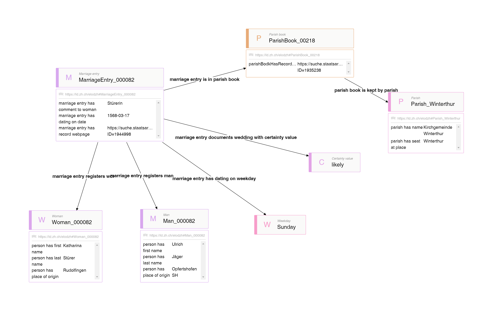

# [--> SPARQL-Endpoint](https://lindas.admin.ch/sparql/)

[--> Alle Tripel](https://github.com/stazh/sw-ehedaten/blob/main/queries/elodzh/alle_tripel.sparql)

[--> Alle Frauenvornamen](https://github.com/stazh/sw-ehedaten/blob/main/queries/elodzh/Frauenvornamen.sparql)

[--> Entwicklung der Heiratswochentage auf dem Land](https://github.com/stazh/sw-ehedaten/blob/main/queries/elodzh/wochentage_land.sparql)

[--> Entwicklung der Heiratswochentage in den Städten](https://github.com/stazh/sw-ehedaten/blob/main/queries/elodzh/wochentage_stadt.sparql)

[--> Heiratswochentage wenn Vermerk Jungfrau](https://github.com/stazh/sw-ehedaten/blob/main/queries/elodzh/heiratswochentage_mit_vermerk_jungfrau.sparql)

# [--> Graph-Explorer](https://int.lindas.admin.ch/graph-explorer/)

